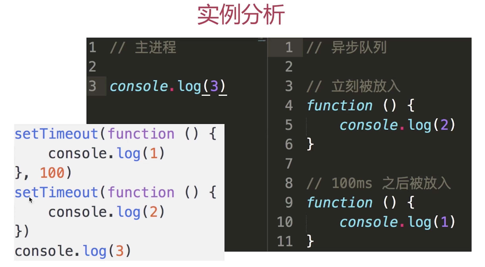
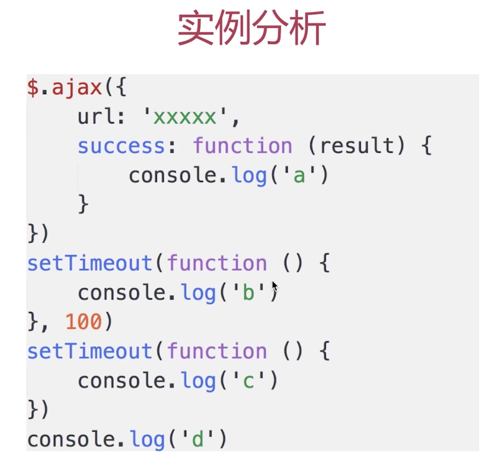
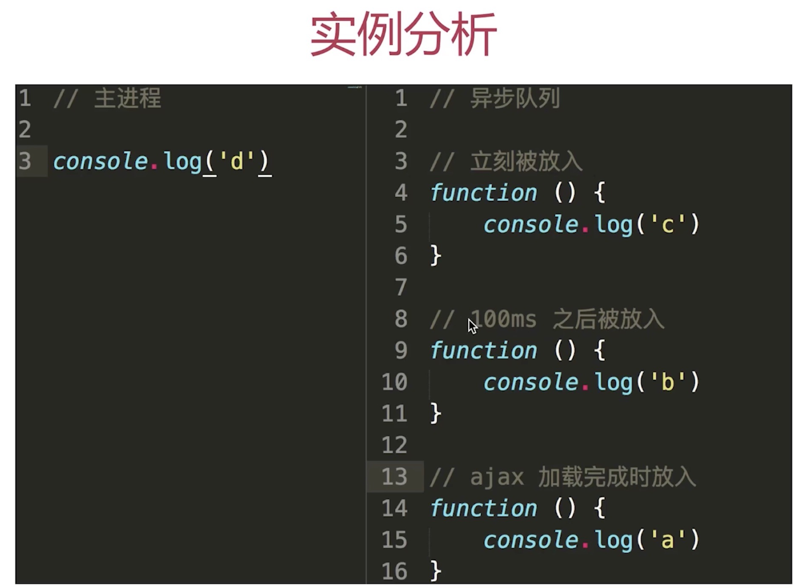
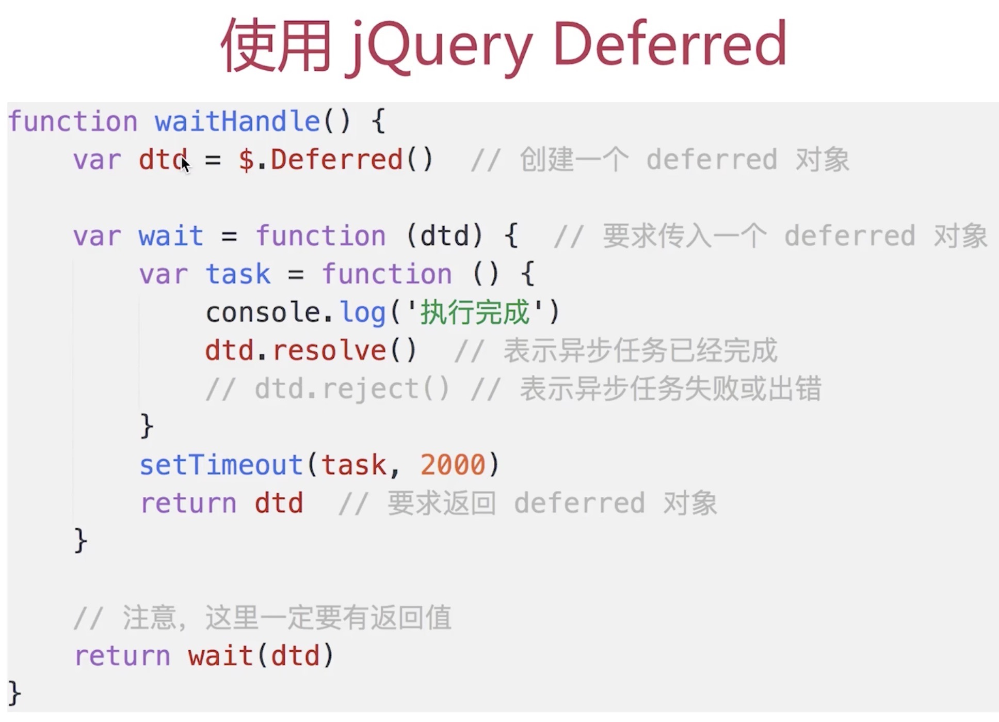
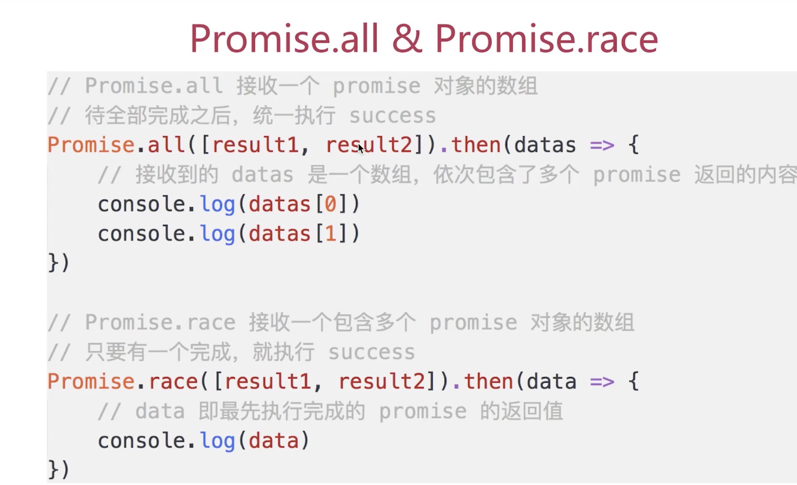

### 异步
---
* 什么是单线程，和异步有什么关系
* 什么是event-loop
* 是否用过jQuery的Deferred
* Promise的基本使用和原理
* 介绍一下async/await（和promise的联系和区别）
* 总结一下当前js解决异步的方案

#### 什么是单线程,和异步的关系
---
* 单线程 - 只有一个线程，同一时间，只能做同一件事情

* 原因 - 避免DOM渲染的冲突
1. 浏览器需要渲染Dom
2. JS修改DOM结构
3. JS执行的时候,浏览器DOM渲染会暂停
4. 两段JS也不能同时执行(都修改DOM就冲突了)
5. webworker支持多线程，但是不能访问DOM
* 解决方案 - 异步
1. 问题一： 没按照书写方式方式执行，可读性差
2. 问题二： callback中不容易模块化

*问题解答*
* 单线程就是同一时间只能做同一件事情,两段js不能同时执行
* 原因就是为了避免DOM渲染的冲突
* 异步是一种"无奈"的解决方案,虽然有很多问题

#### 什么是event-loop
---
* 知识串联
(1)、单线程-同时间只能做同一件事
(2)、原因-避免DOM渲染冲突
(3)、解决方案-异步
(4)、实现方式-event loop
* 文字解释: 
(1). 事件轮询,js实现异步的具体解决方案
(2). 同步代码，直接执行
(3). 异步函数放在异步队列中
(4). 待同步函数执行完毕，轮询执行 异步队列 的函数

* 实例分析
(1). 
(2). 


`ajax请求成功后才把success放入异步队列中，这里并不能确定ajax的返回时间，所以可能有2种结果：dcba或者dcab`

*问题解答*
* 事件轮询,js实现异步的具体解决方案
* 什么是异步队列，何时被放入异步队列（立即放入、一段时间后放入、ajax有返回结果后再放入）
* 轮询的过程（像哨兵一样，异步队列中有函数，则放入主进程执行完成后，再进行轮询监听）

#### 是否用过jQuery的Deferred(延迟)
---
* jQuery 1.5的变化
(1)、无法改变js异步和单线程的本质
(2)、只能从写法上杜绝callback这种形式
(3)、它是一种语法糖形式，但是解耦了代码
(4)、提现开放封闭原则(扩展开放、修改封闭)

* 使用jquery deferred



```
var waitHandle = function() {
            var dtd = $.Deferred();
            var wait = function (dtd) {
                var task = function () {
                    console.log('执行完成')
                    // 成功
                    dtd.resolve()
                }
                setTimeout(task, 2000)
                return dtd;
                
            }
            return wait(dtd)
        }
        var w = waitHandle();
        w.then(function() {
            console.log('ok 1')
        },function() {
            console.log('err 1')
        })
        w.then(function() {
            console.log('ok 2')
        },function() {
            console.log('err 2')
        })
```

* 总结,dtd的API可分为两类,用意不同
(1)、第一类：(主动触发) dtd.resolve(),dtd.reject()
(2)、第二类：（被动监听）dtd.then()、dtd.done()、dtd.fail()
(3)、这两个类是要分开写，否则后果很严重！
(4)、可以在上面代码最后执行dtd.reject()试一下后果
```
    var w = waitHandle();
    w.reject()
    w.then(function() {
        console.log('ok 1')
    },function() {
        console.log('err 1')
    })
    w.then(function() {
        console.log('ok 2')
    },function() {
        console.log('err 2')
    })
```
怎么解决这个问题？修改返回对象`return dtd.promise();` 
```
var waitHandle = function() {
            var dtd = $.Deferred();
            var wait = function (dtd) {
                var task = function () {
                    console.log('执行完成')
                    // 成功
                    dtd.resolve()
                }
                setTimeout(task, 2000)
                return dtd.promise; //返回promise对象，而不是dtd
                
            }
            return wait(dtd)
        }
        var w = waitHandle();
        w.then(function() {
            console.log('ok 1')
        },function() {
            console.log('err 1')
        })
        w.then(function() {
            console.log('ok 2')
        },function() {
            console.log('err 2')
        })
```
```
var w = waitHandle();
    w.reject() // 报错
```
*问题解答*
* 可以说jquery1.5对ajax的改变举例
* 说明如何简单的封装、使用Defered(开放封闭原则)
* 说明promise和Defered的区别（defered提供主动触发、被动监听，而promise提供被动监听的方法，不容易被篡改）


#### promise
---
* 基本使用和原理
(1)、基本语法回顾
```
 function loadImg (src) {
    return new Promise(function(resolve, reject) {
        var img = document.createElement('img')
        img.onload = function() {
            resolve(img)
        }
        img.onerror = function() {
            reject('图片加载失败')
        }
        img.src = src
    })
}
let src= 'https://img12.360buyimg.com/img/s156x156_jfs/t1/150903/34/8586/17241/5fc5ec72E11a0b9ce/6da3cda8181b0d99.png'
var result = loadImg(src);
result.then(function(img) {
    console.log('width', img.width)
    return img
},function() {
    console.log('error width')
}).then(function(img) {
    console.log('height', img.height)
},function() {
    console.log('error height')
})
```
(2)、异常捕获
```
result.then(function(img) {
        console.log('width', img.width)
        return img
    }).then(function(img) {
        console.log('height', img.height)
        return img
    }).catch(function(e) {
        // 统一捕获异常
        console.log(e)
    })
```
(3)、多个串联
```
var src1 = 'https://img12.360buyimg.com/img/s156x156_jfs/t1/141653/21/16528/22481/5fc5ec63E441e30a1/79c42e95be4df694.png';
var result1 = loadImg(src1);
var src2 = 'https://img12.360buyimg.com/img/jfs/t1/136919/33/18097/101843/5fc51a7bE6879c321/4ebd24bc3448e705.gif';
var result2 = loadImg(src2);
result1.then(function (img) {
    console.log('第一个图片加载完成', img.width);
    return result2
}).then(function (img) {
    console.log('第二个图片加载完成', img.width);
}).catch(function(e) {
    // 统一捕获异常
    console.log(e)
})
```
(4)、Promise.all和Promise.race

```
Promise.all([result1, result2]).then(function (datas){
    console.log(datas[0])
    console.log(datas[1])
})
Promise.race([result1, result2]).then(function (data){
    console.log('race', data)
})
```
(5)、Promise标准

* 闲谈

1) 任何技术推广使用都需要一套标准来支撑
2) 任何不符合标准的东西，终将被用户所抛弃
3）不要挑战标准，不要自造标准

* 状态变化

1) 三种状态：pending、fullfilled(成功)、rejected（失败）
2) 初始状态pending
3) 只能从pending变成fullfilled、或者从pending变成rejected
4) 状态变化不可逆


* then

1) Promise实例必须定义then方法
2）then接收2个函数
3) then()必须返回一个promise实例
`如果then没有明文返回promise实例,那这个then它返回的是本身的这个promise实例`
```
var result = loadImg('');
result.then(function(img) {
    console.log('1')
    // 返回还是result实例
}).then(function() {
    console.log('2')
})
```
*问题解答*
* 基本语法复习
* 如何捕获异常（Error和reject都要考虑，通过catch来处理）
* 多个串联-链式执行的好处
* Promise.all和Promise.race(只要有一个返回，就继续执行，其他的promise不再管)
* Promise标准-状态变化,then函数


#### 介绍一下async/await（和promise的联系和区别）
* then 只是将callback拆分了
* async/await是最直接的同步写法
* 语法
(1)、使用await,函数必须用async标识
(2)、await后面跟的是一个Promise实例
(3)、需要babel-ployfill

*问题解答*
 * 基本语法
 * 使用了Promise,并没有和Promise冲突(是对promise的扩展)
 * 完全是同步的语法,再也没有回调函数
 * 但是：改变不了js单线程、异步的本质


 ### 总结
 ---

#### 当前异步的解决方案
* jquery Deferred
* Promise
* Async/await
* Generator
