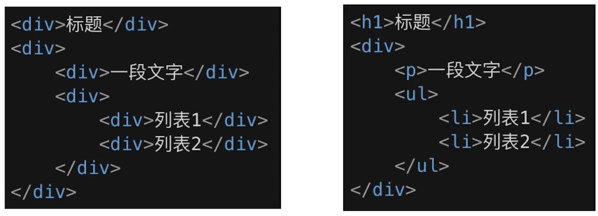
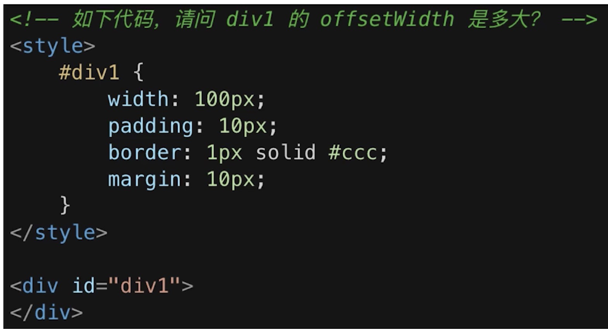
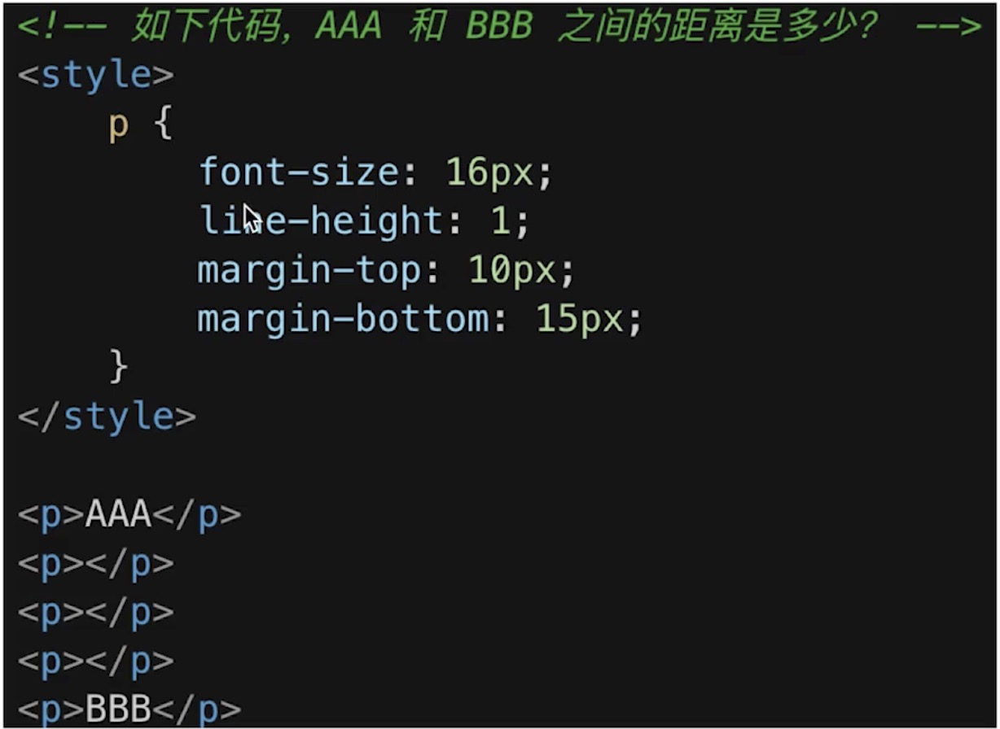
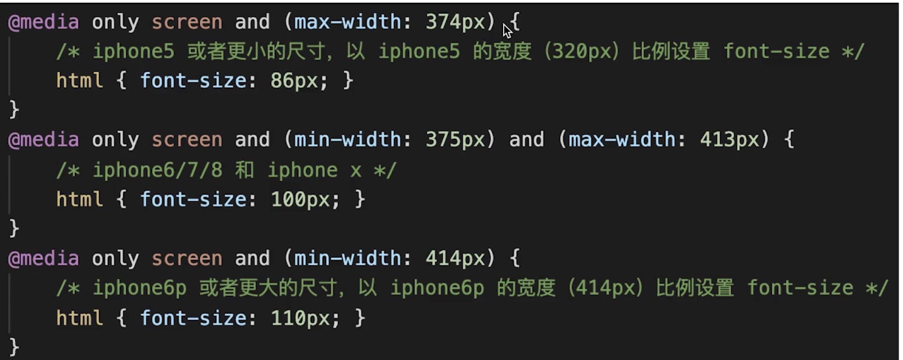

#### html面试题
---
1. 如何理解html语义化？
2. 默认情况下，哪些标签是块级元素，哪些是内联元素？

#### css题目
---
1. 分析知识模块
    * 布局
    * 定位
    * 图文样式
    * 响应式
    * css3
2. 布局
    * 盒子模型的宽度如何计算？
    * margin纵向重叠？
    * margin负值的问题？
    * BFC理解和应用
    * float布局问题，以及clearfix
    * flex画骰子
3. 定位
    * absolute和releative分别依据什么定位？
    * 居中对其有哪些方式？
4. 图文样式
    * line-height的继承
5. 响应式
    * rem是什么？
    * 如何实现响应式？
6. css3
    * css3动画

#### html
---
1. 语义化

*解答*
```
1. 让人更容易读懂（增加代码可读性）
2. 让搜索引擎更容易读懂(SEO)
再举个简单例子
```

2. 块状元素和内联元素？
*解答*
```
1. display:block/table;可独占一行，有div h1 h2 table ul ol p等
2. display: inline/inline-block;有span img input button等
```

#### css问题布局
---
1. 盒模型宽度计算

*解答*
```
offsetWidth = (内容宽度+内边距+边框),无外边距
答案是122px
```
加入`box-sizing: border-box`,`offsetWidth`的值就是100px,因为这个width包含width、padding和border

2. margin 纵向重叠问题

*解答*
```
相邻元素的margin-top和margin-bottom 会发生重叠
空白内容的<p></p>也会重叠
答案：15px
```

3. margin负值问题
*解答*
```
1. margin-left和margin-top为负值,该元素向左或向上移动相应距离
2. margin-right为负值，自身不受影响，右侧元素向左移动相应距离
3. margin-bottom 为负值，自身不受影响，下方元素向上移动相应距离
```

4. BFC的理解和应用
*解答*
```
1. Block format context,块级格式化上下文
2. 一块独立渲染区域,内部元素的渲染不会影响到边界以外的元素
3. 形成BFC的常见条件
    a. float不等于none
    b. position是absolute或fixed
    c. overflow不等于visible
    d. display是flex inline-block等
4. BFC的常见应用
    a. 清除浮动
```

5. float布局

a. 圣杯布局和双飞翼布局的目的
    1)、三栏布局，中间一栏最先加载和渲染（内容最重要）
    2）、两侧内容固定，中间内容随着宽度自适应
    3)、一般用于pc网页
b. 圣杯布局和双飞翼布局技术总结
    1）、使用float布局
    2）、两侧使用margin负值，以便和中间内容横向重叠
    3）、防止中间内容被两侧覆盖，一个用padding 一个用margin
c. 代码实现
圣杯布局
```
<!DOCTYPE html>
<html lang="en">
<head>
    <meta charset="UTF-8">
    <meta name="viewport" content="width=device-width, initial-scale=1.0">
    <title>Document</title>
    <style>
       body {
           min-width: 550px;
           }
        #container {
            padding-left: 200px;
            padding-right: 150px;
        }
        .cloumn {
               float: left;
           }
        #center {
            background-color: #ccc;
            width: 100%;
        }
        #left {
            position: relative;
            background-color: yellow;
            width: 200px;
            margin-left: -100%;
            right: 200px;
        }
        #right {
            background-color: red;
            width: 150px;
            margin-right: -150px; //margin-right为负值，后面元素左移，相当于是宽度减小
        }
        #footer {
            
            text-align: center;
        }
        /* 手写clearfix*/
        .clearfix:after {
            content: '';
            display: table;
            clear: both
        }
        .clearfix{
            *zoom:1 /* 兼容IE低版本*/
        }
    </style>
</head>
<body>
    <div>this is header</div>
    <div id="container" class="clearfix">
        <div id="center" class="cloumn">center</div>
        <div id="left" class="cloumn">left</div>
        <div id="right" class="cloumn">right</div>
    </div>
    <div id="footer">this is footer</div>
</body>
</html>
 ```
 双飞翼布局
 ```
 <!DOCTYPE html>
<html lang="en">
<head>
    <meta charset="UTF-8">
    <meta name="viewport" content="width=device-width, initial-scale=1.0">
    <title>Document</title>
    <style>
        body {
            min-height: 550px;
        }
        .col {
            float: left;
        }
        #main {
            width: 100%;
            height: 200px;
            background-color: #ccc;
        }
        #main-wrap {
            margin: 0 190px 0 190px;
        }
        #left {
            width: 190px;
            height: 200px;
            background-color: red;
            margin-left: -100%;
        }
        #right {
            width: 190px;
            height: 200px;
            background-color: pink;
            margin-left: -190px;
        }
    </style>
</head>
<body>
    <div id='main' class='col'>
        <div id='main-wrap'>
            this is main
        </div>
    </div>
    <div id='left' class='col'>
        this is left
    </div>
    <div id='right' class='col'>
        this is right
    </div>
</body>
</html>
 ```

6. flex布局

a. 常用语法回顾
    `flex-direction`:主轴方向、`justify-content`:主轴对齐方式
    `align-items`: 交叉轴对齐方式、`flex-wrap`：换行
    `align-self`: 子元素在交叉轴对齐方式

b. 代码演示
```
<!DOCTYPE html>
<html lang="en">
<head>
    <meta charset="UTF-8">
    <meta name="viewport" content="width=device-width, initial-scale=1.0">
    <title>Document</title>
    <style>
        .box {
            width: 200px;
            height: 200px;
            border: 1px solid #ccc;
            border-radius: 20px;
            padding: 20px;
            display: flex;
            justify-content: space-between;
        }
        .item {
            display: block;
            width: 40px;
            height: 40px;
            border-radius: 50%;
            background-color: red;
        }

        .item:nth-child(2) {
            align-self: center;
        }

        .item:nth-child(3) {
            align-self: flex-end;
        }
    </style>
</head>
<body>
   <div class='box'>
       <span class='item'></span>
       <span class='item'></span>
       <span class='item'></span>
   </div> 
</body>
</html>
```

#### css问题定位
---
1. absolute和releative分别依据什么定位？
```
releative依据自身定位
absolute依据最近一层的父定位元素进行定位
定位元素:absolute/relative/fixed/body
```

2. 居中对齐方式
    a. 水平居中
        1）、inline元素：`text-align: center`
        2)、block元素： `margin:auto`
        3)、absolute元素： `left:50%+margin-left负值(须知道子元素宽度)`
    b. 垂直居中
        1）、inline元素：`line-heigth和height相等`
        2)、absolute元素： `top:50%+margin-top负值(须知道子元素高度)`
        3)、absolute元素： `top:50%;left:50%;transform:translate(-50%, -50%)`(兼容性不太好)
        3)、absolute元素： `top、left、bottom、right =0 + margin: auto`

#### css图文样式
---
1. line-height如何继承
    a)、写具体数值，如30px,则继承该值
    b)、写比例,如2/1.5,则继承该比例
    c)、写百分比,如200%,则继承计算出来的值
    ```
    <style>
        body {
            font-size: 20px;
            line-height: 2;
        }
        p {
            font-size: 16px;
            background-color: #ccc;
        }
    </style>
    ```
    如果是比例，p元素中有font-size,那么p的line-height是p的`font-size`*`line-height`,例子中是32px，p中没有font-size,p的line-height是父元素的`font-size` * `line-height`
    ```
    <style>
        body {
            font-size: 20px;
            line-height: 200%;
        }
        p {
            font-size: 16px;
            background-color: #ccc;
        }
    </style>
    ```
    如果是百分比，p的line-height是父元素的`font-size`*`line-height`,例子中是40px,父元素中没有font-size,p的line-height是p元素的`font-size` * `line-height`

#### css响应式
---
1. rem 是什么？
    a）、rem是一个长度单位
        px,绝对长度单位,最常用
        em,相对长度单位，相对于父元素，不常用
        rem,相对长度单位，相对于根元素(html或者body)，常用于响应式布局

2. 响应式布局的常用方案
   * media-query,根据不同的屏幕宽度设置根元素的`font-size`
   * rem，基于根元素的单位

3. vw/vh
    * rem的弊端：阶梯性(写法上和宽度上呈阶梯状,针对每个像素做实在麻烦)
    
    * 网页视口尺寸
        a)、window.screen.height // 屏幕高度
        b)、window.innerHeight // 网页视口高度（去掉浏览器的头和尾）
        c)、document.body.clentHeight // body高度（取决于页面内容）
    * vh 网页视口高度的1/100
      vw 网页视口宽度的1/100
      vmax 取vh和vm中的较大值，vmin 取vh和vm中的较小值

#### css动画
---
1. 不是面试的重点