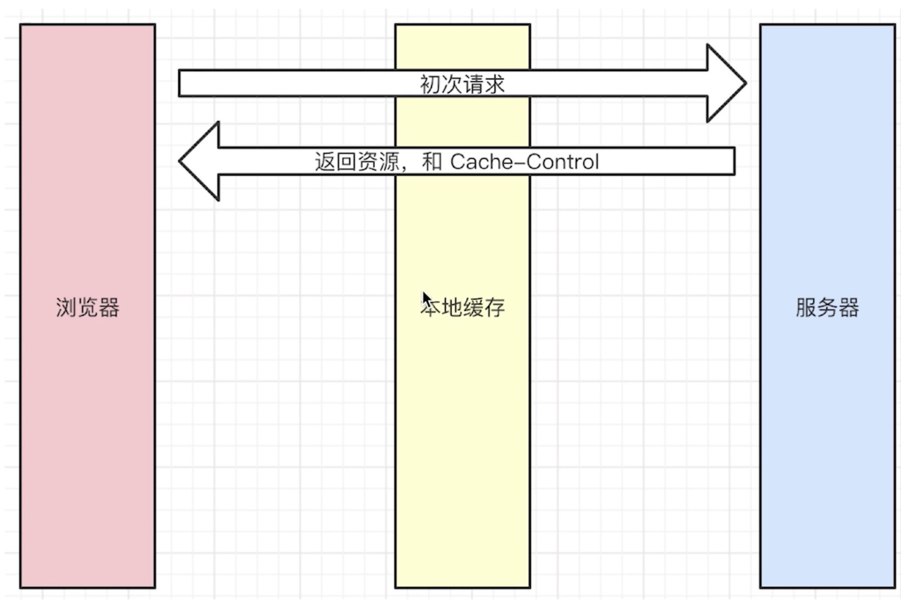

### http
---

#### 常见题目
---

1. http 常见的状态码有哪些
2. http 常见的header有哪些
3. 什么是restful api
4. 描述一下http的缓存机制（重要）

#### 状态码
---
1. 状态码的分类
    * 1xx服务器收到请求
    * 2xx请求成功,如200
    * 3xx重定向,如302(这里我不管了，去找别人吧)
    * 4xx客户端错误，如404
    * 5xx服务端错误，如500
2. 常见状态码
    * 200 成功
    * 301永久重定向(配合location(新地址),浏览器记住这个新地址，以后都会访问新地址，自动处理)
    * 302永久重定向(配合location(新地址),浏览器只是这次访问新地址，自动处理)例如在百度上搜索某个东西，跳转时都是百度的地址，访问的时候，百度会返回302，再去访问新地址
    * 304资源未被修改
    * 404资源未找到
    * 403没有权限
    * 500服务器错误
    * 504网关超时

#### http methods
---
1. 传统的methods
    * get 获取服务器数据
    * post 向服务器提交数据
2. 现在的methods
    * get 获取数据
    * post 新建数据
    * patch/put 更新数据
    * delete 删除数据
3. Restful API
    * 一种新的API设计方法(早已推广使用)
    * 传统API设计:把每个url当做一个功能
    * Restful API:把每个url当做一个唯一的资源标识
4. 如何设计成一个资源？
    * 尽量不用url参数
        1) 传统api设计：/api/list?pageIndex=2
        2) Restful Api设计： /api/list/2
    * 用method表示操作类型
        传统api设计
        ---
        1) post请求：/api/create-blog
        2) post请求： /api/update-blog?id=100
        3) get请求：/api/get-blog?id=100
        ---
        restful api设计(用method表示操作类型)
        ---
        1) post请求：/api/blog
        2) patch请求： /api/blog/100
        3) get请求：/api/blog/100

#### http常见headers
---
* Request headers
    ```
    Accept浏览器可接收的数据格式
    Accept-Encoding浏览器可接收的压缩算法,如gzip
    Accept-Languange浏览器可接收的语言，如zh-CN
    Connection:keep-alive一次TCP连接重复使用
    cookie
    Host:请求域名
    user-agent（ua）: 浏览器信息
    Content-type发送数据的格式,如application/json
    ```
* Response headers
    ```
    Content-type返回数据的格式,如application/json
    Content-length返回数据的大小,多少字节
    Content-Encoding: 返回数据的压缩算法,如gzip
    Set-cookie
    ```
* 缓存相关的headers
    ```
    Cache-Controls Expires
    Last-Modified If-Modified-Since
    Etag If-None-Match
    ```

#### http缓存
---
1. 知识点
* 关于缓存的介绍
* http缓存策略(强制缓存+协商缓存)
* 刷新操作方式对缓存的影响

2. 什么是缓存？
可以把一些没有必要重新获取一遍的东西再次请求获取

3. 为什么需要缓存
加载速度更快,减少网络请求

4. 哪些资源可以被缓存？
静态资源——（js css img）

5. http缓存-强制缓存
    * cache-control在Reponse Headers中，可以控制强制缓存的逻辑,单位是秒
    * cache-control的值
    ```
    max-age：设置最大过期时间（重要）
    no-cache: 不用强制缓存（即本地缓存）,交给服务端处理（重要）
    no-store: 不用本地缓存和服务端的缓存策略
    private: 允许最终用户做缓存
    public：中间的路由缓存
    ```


    
    
    

    
    * Expires同在Reponnse Headers中，同为控制缓存过期,已被cache-control代替
6. http缓存-协商缓存
    * 服务端缓存策略(服务端告诉资源没有改动，可以用本地的缓存内容)
    * 服务器判断客户端资源,是否和服务端资源一样
    * 一致则返回304,否则返回200和最新的资源

7. 资源标识
    * 在Response headers中,有两种
    ```
    Last-Modified 资源的最后修改时间
    Etag 资源的唯一标识（一个字符串，类似于指纹）
    ```
    * Last-Modified和Etag
        1) 会优先使用Etag
        2）Last-Modified精确到秒级
        3) 如果资源被重复生成,而内容不变,则Etag更精确
    
    
    
8. 刷新操作
    * 正常操作：地址栏输入url,跳转链接,前进后退等
    * 手动刷新
    * 强制刷新
    * 不同刷新操作,不同缓存策略
    ```
    正常操作：强制缓存有效，协商缓存有效
    手动刷新：强制缓存失效，协商缓存有效
    强制刷新： 强制缓存失效，协商缓存失效
    ```
9. 小结
    * 强制缓存cache-control
    * 协商缓存Last-Modified和Etag,304状态码
    * 完整的流程图
    


