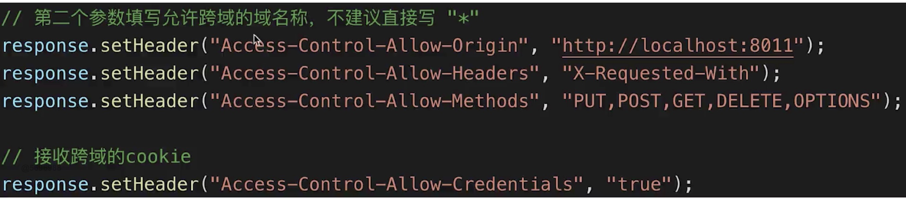

#### 从JS基础知识到js web Api
---
* js基础知识，规定语法（ECMA 262标准）
* js web api,网页的操作API(w3c标准)
* 前者是后者的基础，两者结合才能实际应用

1. 内容
* DOM
* BOM
* 事件绑定
* ajax
* 存储

2. DOM操作（Domcument Object Model）

3. 题目
* DOM 是哪种数据结构
* DOM操作的常用API
* attr和property的区别
* 一次性插入多个DOM节点，考虑性能

4. 知识点
* DOM本质: 一棵树
* DOM节点操作
* DOM结构操作
* DOM性能

5. DOM节点操作
* 获取dom节点: id、classname、tagname、querySelectorAll()
* property和attribute
    1) property：修改对象属性，不会体现到html结构中($p.style.width)
    2）attribute: 修改html属性，会改变html结构（getAttribute(),setAttribute()）
    3）两者都有可能引起DOM渲染

6. DOM结构操作
    * 新增/插入节点(对于现有元素，appendchild会直接移动这个元素)
    * 获取子元素列表(p1.chileNodes),获取父元素(p1.parentNode)
    * 删除子元素
    nodeName获取元素名称
7. DOM性能
    * DOM操作非常昂贵,避免频繁的DOM操作
    * 对DOM查询做缓存
    * 将频繁操作改为一次性操作(例如缓存某个标签的length)
    
    

8. 问题解答
    * DOM 是哪种数据结构: 树型结构，查询父子节点、删除、和插入的操作都是基于树型结构

    * DOM操作的常用API： 
        1) DOM节点操作
        2）DOM 结构操作
        3） attr和property
        
* attr和property的区别
        1) property：修改对象属性，不会体现到html结构中($p.style.width)
        2）attribute: 修改html属性，会改变html结构（getAttribute(),setAttribute()）
* 一次性插入多个DOM节点，考虑性能
    1) 对DOM查询做缓存(例如缓存某个标签的length)
    2) 将频繁操作改为一次性操作(插入多个节点)


### BOM
---

1. 题目
    * 如何识别浏览器类型
    * 分析拆解url各部分

2. 知识点
    * navigator
    * screen
    * locationn
    * history
3. navigator和history
    ```
    // navigator
    const ua = navigator.userAgent;
    const isChrome = ua.indexOf('Chrome');
    console.log(isChrome)

    // screen
    console.log(screen.length)
    console.log(screen.height)

    // location
    console.log(location.href) // 获取链接
    console.log(location.protocol) // http或https
    console.log(location.host) // 域名
    console.log(location.search) // 查询参数
    console.log(location.hash) // 查询哈希值
    console.log(location.pathname) // 查询路径

    // history
    history.back() // 后退
    history.forword() //前进
    ```
4. 问题解答
    * 如何识别浏览器类型： `navigator.userAgent`
    * 分析拆解url各部分:
    ```
    console.log(location.href) // 获取链接
    console.log(location.protocol) // http或https
    console.log(location.host) // 域名
    console.log(location.search) // 查询参数
    console.log(location.hash) // 查询哈希值
    console.log(location.pathname) // 查询路径
    ```

### 事件
---

1. 题目
* 编写一个通用的事件监听函数
* 描述事件冒泡的流程
* 无限下拉的图片列表,如何监听每个图片的点击?

2. 知识点
* 事件绑定
* 事件冒泡
* 事件代理

3. 事件绑定
```
// 通用事件绑定函数
function bindEvent (elem, type, fn) {
    elem.addEventListener(type, fn);
}
const btn1 = document.getElementById('btn1');
bindEvent(btn1, 'click', event =>{ // 返回一个event元素
    alert('clicked')
    // event用法
    console.log(event.target) // 获取触发的元素 
    console.log(event .preventDefault()) //组织默认行为
})
```
4. 事件冒泡
* 基于DOM树形结构
* 事件会顺着触发元素往上冒泡
* 应用场景： 事件代理
```
    <div id="div1">
        <p id="p1">激活</p>
        <p id="p2">取消</p>
        <p id="p3">取消</p>
        <p id="p4">取消</p>
    </div>
    <div id="div2">
        
        <p id="p5">取消</p>
        <p id="p6">取消</p>
    </div>
    <script>
        function bindEvent (elem, type, fn) {
            elem.addEventListener(type, fn);
        }
        const body = document.body
        bindEvent(body, 'click', e=>{
            console.log('取消')
            // console.log(e.target)
        })
        const p1 = document.getElementById('p1')
        bindEvent(p1, 'click', e=>{
            e.stopPropagation(); // 阻止事件冒泡
            console.log('激活')
            // console.log(e.target)
        })

        // const div2 = document.getElementById('div2')
        /* bindEvent(div2, 'click', e=>{
            console.log('div2 clicked')
            console.log(e.target)
        }) */
    </script>
```

5. 事件代理
* 代码简洁
* 减少浏览器内存占用
* 但是，不能滥用
```
<div id='div3'>
    <a href="#">a1</a><br>
    <a href="#">a2</a><br>
    <a href="#">a3</a><br>
    <a href="#">a4</a>
    <button></button>
</div>
<script>
    function bindEvent (elem, type, fn) {
        elem.addEventListener(type, fn);
    }
    const div3 = document.getElementById('div3')
    bindEvent(div3, 'click', e=>{
        e.stopPropagation();
        const target = e.target;
        if(target.nodeName==='A'){
            alert(target.innerHTML)
        }
    })
</script>
```
6. 通用事件监听函数
```
function bindEvent (elem, type, selector, fn) {
    if (fn == null) {
        fn = selector
        selector = null
    }
    elem.addEventListener(type, event => {
        const target = event.target
        if (selector) {
            // 代理
            if (target.matches(selector)) { // 检查某个元素是否匹配某个css选择器
                fn.call(target, event)
            }
        }else{
            // 普通绑定
            fn.call(target, event)
        }
    })
}
const div3 = document.getElementById('div3')
bindEvent(div3, 'click', 'a', function(e){
    e.stopPropagation();
    alert(this.innerHTML)
})
```

7. 问题解答
* 通用事件监听函数： 见6
* 事件冒泡流程：* 基于DOM树形结构 * 事件会顺着触发元素往上冒泡 * 应用场景： 事件代理
* 无限下拉的图片列表,如何监听每个图片的点击?
    1) 事件代理
    2） e.target获取触发元素
    3） 用matches来判断是不是触发元素


### ajax
---
1. 题目
* 手写一个简易的ajax
* 跨域的常用实现方式

2. 知识点
* XMLHttpRequest
* 状态码
* 跨域： 同源策略,跨域解决方案

3. XMLHttpRequest
```
// get请求
const xhr = new XMLHttpRequest()
xhr.open("GET", "/api", true) // 异步
xhr.onreadystatechange = function () {
    // 这里的函数异步执行
    if (xhr.readyState === 4) {
        if (xhr.status === 200) {
            alert(xhr.reponseText)
        }
    }
}
xhr.send(null)
// post 请求
xhr.open("POST", "/login", false) // 异步
    const postData = {
        username: 'zhangsan',
        password: 123
    }
    xhr.send(JSON.stringify(postData))
```
* xhr.readyState
    1) 0 -(未初始化):未调用send()方法
    2）1 - (载入)已调用send()方法,正在发送请求
    3） 2- (载入完成)send()方法执行完成,已经接收到全部响应内容
    4）3 - (交互)正在解析响应内容
    5）4 - (完成) 响应内容解析完成,可以在客户端调用
* 状态码
    1) 2xx - 表示成功处理请求
    2）3xx - 需要重定向,浏览器直接跳转呢，如301、302、304
    3）4xx - 客户端请求错误，如404、403
    4）5xx - 服务端错误

### 跨域
---
* 同源策略(仅限于对浏览器有限制)
    1. ajax请求时，浏览器要求当前网页和server必须同源(安全)
    2. 同源： 协议、域名、端口,三者必须一致

* 加载图片cssjs可无视同源策略(可绕过同源策略)
    ```
     
    <link href=''></link>
    <script src=''></script>
    ```
    1. ``可用于统计打点,图片地址上写上第三方服务的地址
    2. `<link><script>`可使用cdn,cdn一般都是外域
    3. `<script>`可实现JSONP
* 跨域
    1. 所有的跨域，都必须经过server端允许和配合
    2. 未经server端允许就实现跨域,说明浏览器有漏洞,危险信号

* jsonp
    1. 访问https//www.baidu.com,服务端一定返回一个html文件吗
    2. 服务器可以任意动态拼接数据返回，只要符合html格式要求
    3. 同理于`<script src='xxx.js'>` // 只要符合js格式要求
    ---
    4. `<script>`可绕过跨域限制
    5. 服务端可任意动态拼接数据返回
    6. 所以，`<script>`就可以获得跨域的数据,只要服务端愿意返回


* cors

只需要知道服务端设置信息来实现跨域访问

* 题目解答
    1. 手写一个简易的ajax
    ```
    function ajax(url) {
       return new Promise((resolve, reject)=> {
            const xhr = new XMLHttpRequest()
            xhr.open('GET', url, true)
            xhr.onreadystatechange = function(){
                if (xhr.readyState == 4) {
                    if (xhr.status ==200){
                        console.log(222)
                        resolve(JSON.parse(xhr.responseText))
                    } else {
                        reject(new Error('404'))
                    }
                }
            }
            xhr.send(null)
        })
    }
    const url = '/data/test.json';
    ajax(url).then(data=>{
        console.log('data', data)
    }).catch(e=>{
        console.error(e)
    })
    ```
    2. 跨域的实现方式
    * JSONP(原理)
    * CORS

    3. ajax常用api:jquery/fetch/axios

### cookie
---
1. 题目: 描述cookie loacalstorage sessionstorage
2. cookie
    * 本身用于浏览器和server通信
    * 被'借用'来用于本地存储
    * 可用document.cookie=''来修改 ,格式以';'分隔
    ---
    缺点
    * 存储大小,最大4kB
    * http请求时需要发送到服务端,增加请求数据量
    * 只能用document.cookie=''来修改，太过简陋
3. localStorage和sessionStorage
    * html5专门为存储而设计,最大可存5M
    * API简单易用,setItem和getItem(localStorage.getItem(key))
    * 不会随http请求发送出去
    ---
    区别
    * localStorage数据会永久存储,除非代码或手动删除
    * sessionStorage数据只存在于当前会话,浏览器关闭则清空
    * 一般用localstorage会更多一些
4. 题目解答
    * 容量
    * api易用性
    * 是否跟随http请求发送出去


    