### JS异步进阶
---

#### 主要内容
---
* event loop
* promise进阶
* async/await
* 宏任务/微任务

#### 异步面试题
---
* 请描述event-loop(事件循环、事件轮询)的机制，可画图
* 什么是宏任务和微任务,有什么区别？
* promise有哪几种状态，有什么区别

#### event loop(事件循环/事件轮询)
---
1. 为什么要引入

* js是单线程
* 异步要基于回调来实现
* event loop就是异步回调的实现原理

2. js如何执行？
* 从前到后，一行一行执行
* 如果某一行执行报错,则停止下面代码的执行
* 先把同步代码执行完,再执行异步

```
console.log('Hi');
setTimeout(function(){
    console.log('cb1')
}, 5000)
console.log('bye')
```
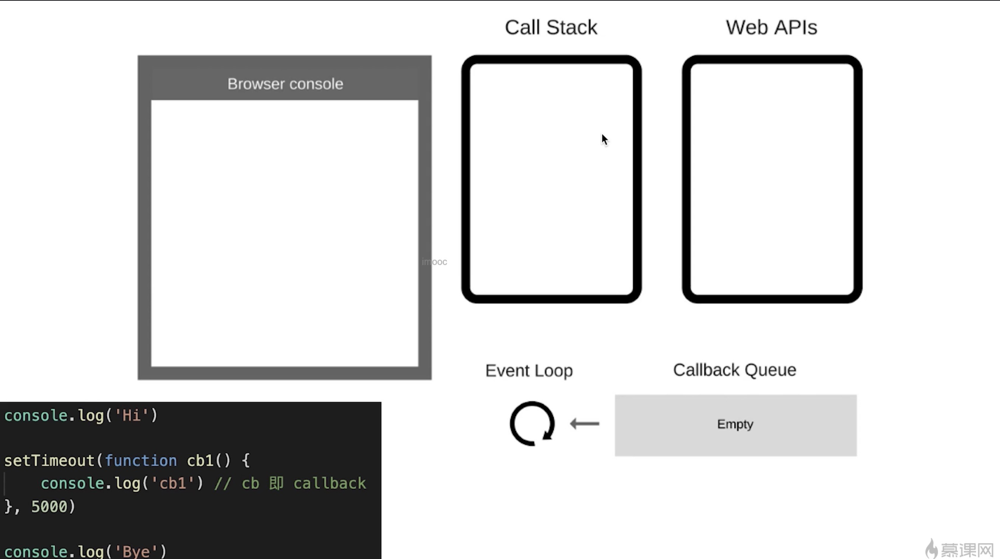
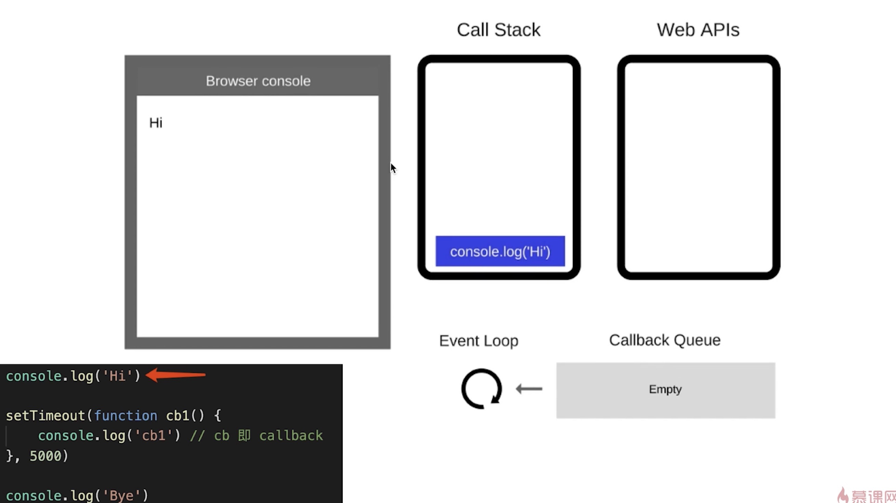
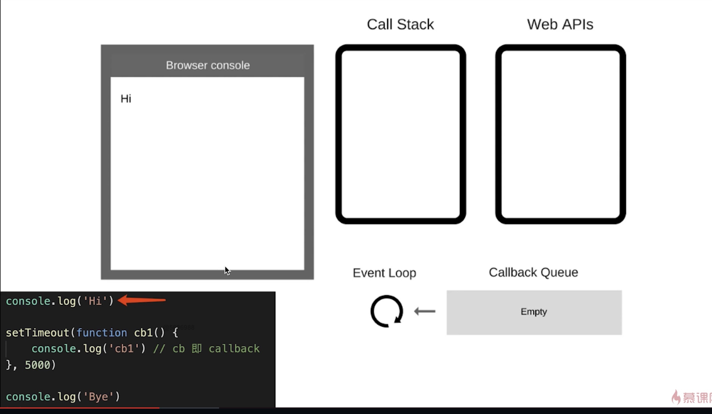
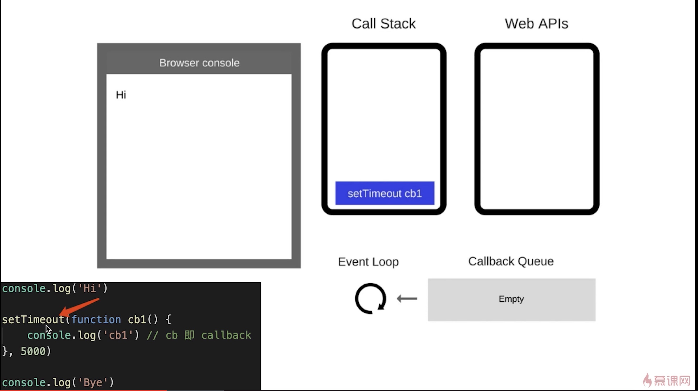
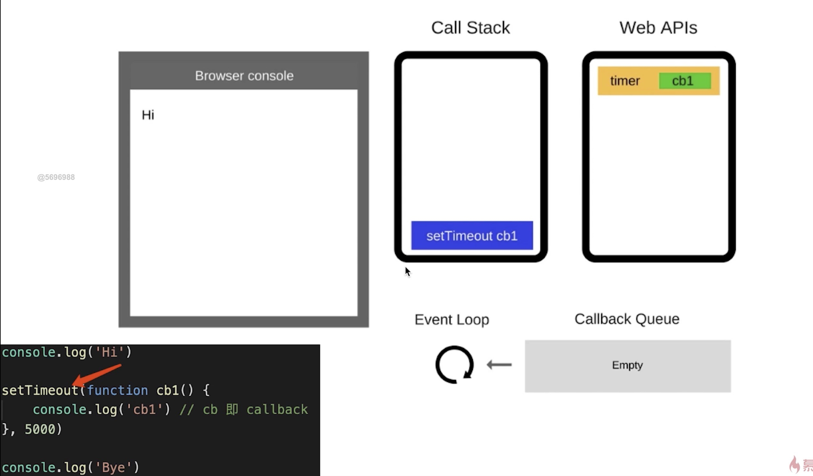
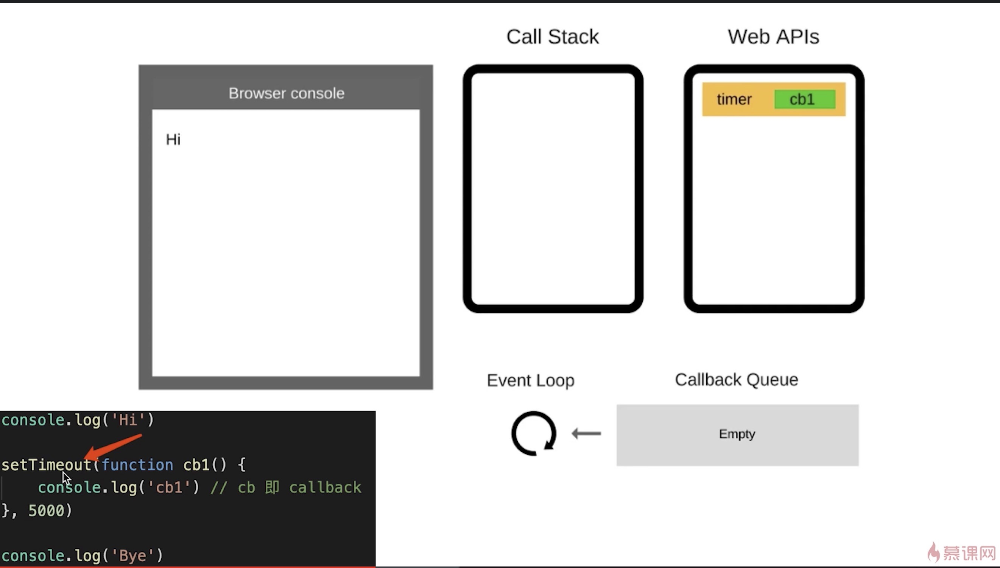
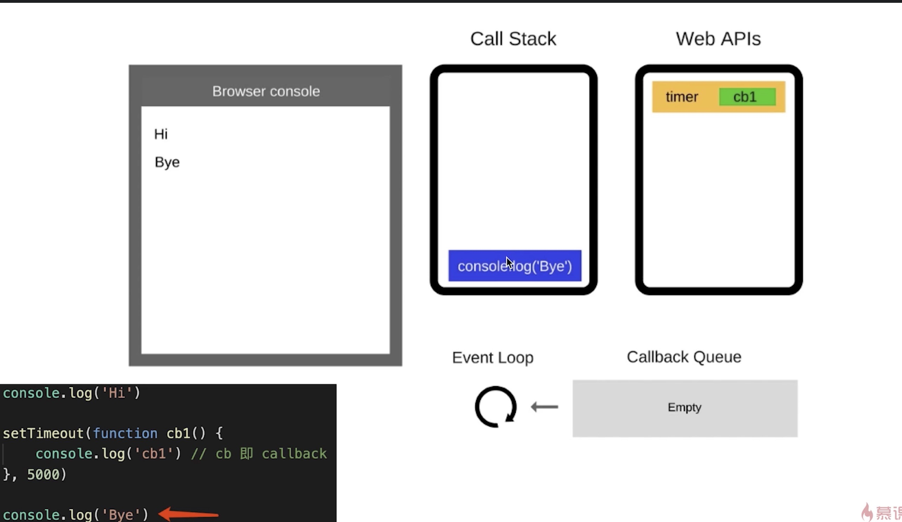
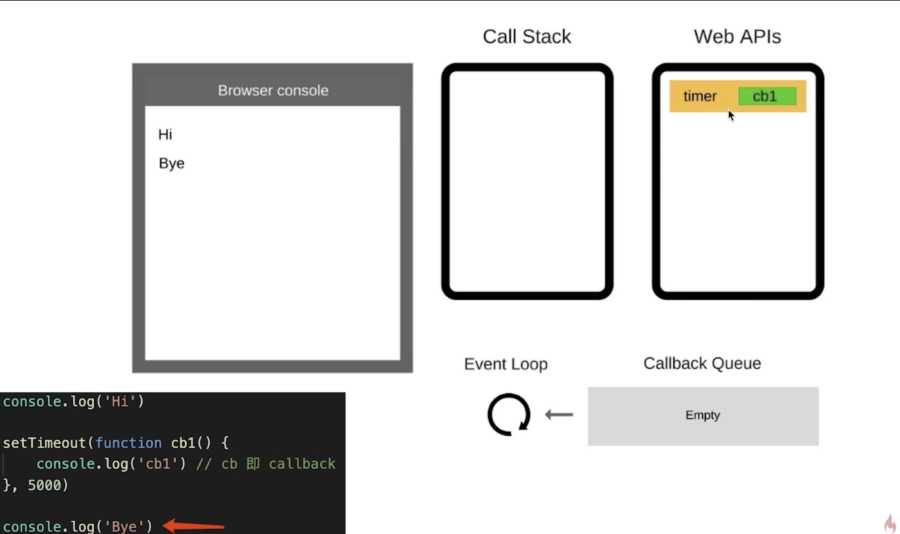
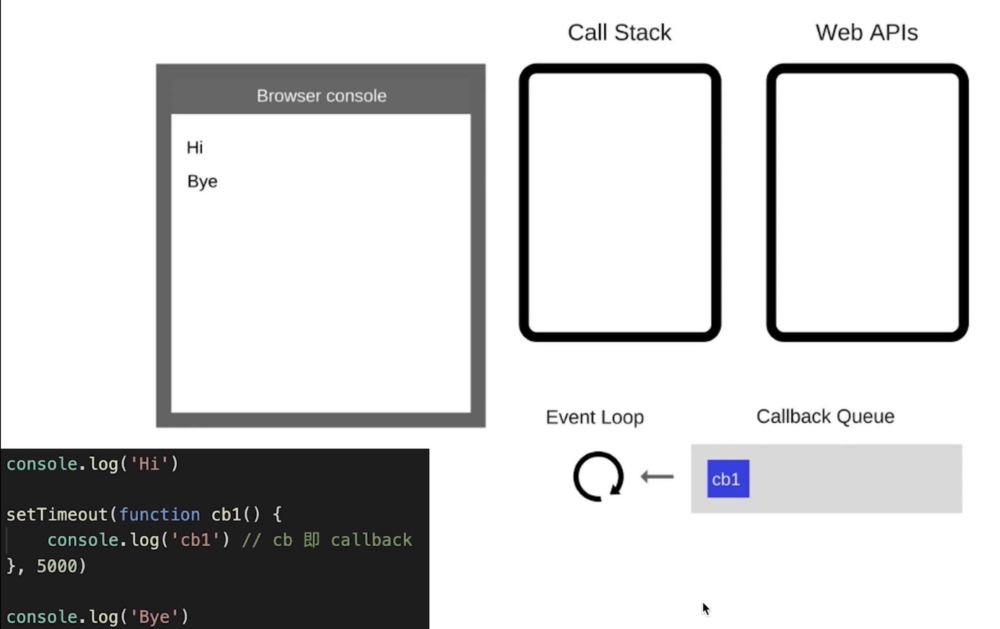
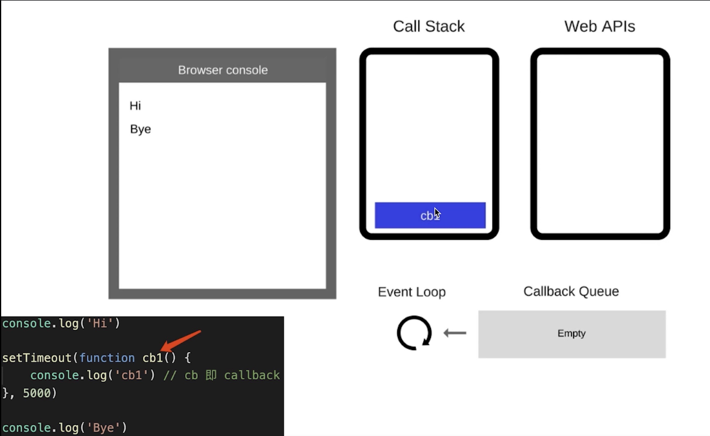
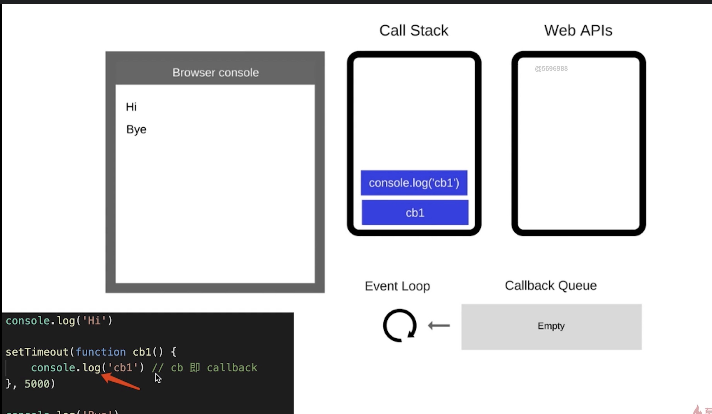

3. 总结

* 同步代码,一行一行放在Call Stack中执行
* 遇到异步,会先'记录'下，等待时机(定时、网络请求)
* 时机一到，就移动到callback quene
* 如call stack为空（即同步代码执行完），Event loop开始工作
* 轮询查找Callback quene,如有则移动到call stack执行
* 然后继续轮询查找（永动机一样）

#### DOM事件和event-loop

* js是单线程的
* 异步(setTimeout, ajax等)使用回调,基于event-loop
* DOM事件也使用回调,基于event-loop,但是DOM事件不是回调

异步和DOM事件的回调函数放入`callback quene`触发时机不一样,触发时机是由浏览器决定

```
document.getElementId('btn').click(function(){
    console.log('clicked')
})
console.log('bye')
```
执行click函数（放入`call stack`中执行），将点击的回调函数放入`web api`中，监听到点击时，将这个回调放入`callback quene`,

#### promise的三种状态
---
1. 3种状态

* pending resolved rejected
* pengding -> resolved 或 pending -> rejected
* 过程不可逆

2. 状态的表现

* pending 状态，不会出发then和catch
* resolved状态，会触发后续的then回调函数
* rejected状态，会触发后续的catch回调函数

#### Promise的then和catch如何影响状态的变化
---
1. then和catch改变状态

* then正常返回resolved状态的promise,里面有报错则返回rejected状态的promise
* catch正常返回resolved状态的promise,里面有报错则返回rejected状态的promise

```
const p3 = Promise.reject('my error').catch(err => {
    console.log(err)
})
console.log('p3', p3)
p3.then(()=>{ // p3返回的是一个resolve状态的promise
    console.log(100)
})
const p4 = Promise.reject('my error').catch(err => {
    throw new Error('error')
})
console.log('p4', p4)
p4.then(()=>{
    console.log(200)
}).catch(e=>{
    console.log(e)
})
```
 
#### Promise总结
---
* 三种状态，状态的表现和变化
* then和catch对状态的影响（重要）
* then和catch的链式调用（常考）


#### async/await
---
1. 背景
* 异步回调有callback hell的风险
* Promise解决了这个问题，是通过then catch链式调用的,但也是基于回调函数的
* async/await 是同步语法编写异步代码，消灭了回调函数(await后面还可以跟async函数)

2. async/await和Promise的关系

* async/await是消灭异步回调的终极武器
* 但和promise并不互斥
* 反而，两者相辅相成
---
* 执行async函数，返回的是Promise对象
* await相当于Promise的then
* try...catch...可捕获异常,代替了Promise的catch

3. async/await是语法糖，异步的本质还是回调函数
* async/await是消灭异步回调的终极武器
* js还是单线程，还得是有异步，还得是基于event loop
* async/await还是语法糖，但这颗糖很香!

```
async function async1(){
    console.log('async1 start') //2
    await async2()
    // await 后面的，都可以看做是callback里的内容，即异步
    console.log('async1 end') // 5
}

async function async2(){
    console.log('async2') // 3
}
console.log('script start') // 1
async1()
console.log('script end') // 4
// 同步代码执行完,开始event loop
```

#### for...of

1. for...in是常规的同步遍历
2. for...of常用于异步的遍历

```
const a = [1,2,3]

!(async function(){
    for (let i of a) {
        const res = await multi(i);
        console.log(res)
    }
})()
```
#### async/await总结
---
* async/await解决了异步回调,是一个很香的语法糖
* async/await和Promise的关系，重要
* for...of...

#### 宏任务和微任务
---
1. 知识点
* 什么是宏任务(macrotask)和微任务(microtask)
* event loop 和Dom渲染
* 宏任务和微任务区别

2. 宏任务和微任务
* 宏任务： setTimeout、 setInterval、ajax、 DOM事件
* 微任务： Promise、 async/await
* 微任务执行时机比宏任务要早

```
console.log(100) // 1
setTimeout(()=>{
    console.log(200) //4
})
Promise.resolve().then(()=>{
    console.log(300) // 3
})
console.log(400) //2
```

3. event loop 和Dom渲染
* 再次回归一遍event loop的过程
* JS是单线程的，而且和DOM渲染共用一个线程
* JS执行的时候，得留一些时间供DOM渲染
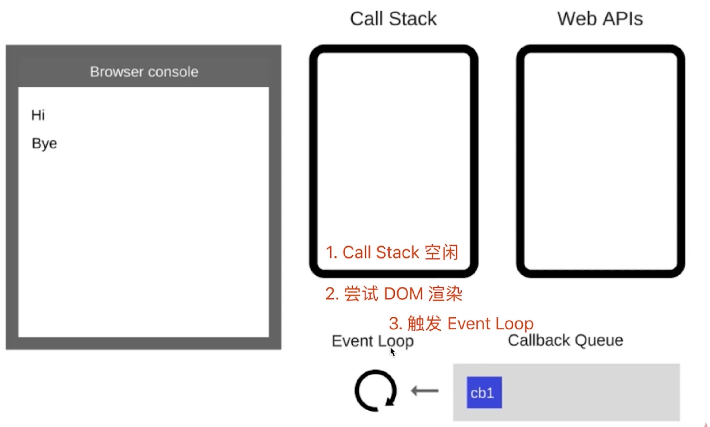

---
* 每次call stack清空后(即每次轮询结束)，即同步任务执行完
* 都是DOM重新渲染的机会,DOM结构如有改变则重新渲染
* 然后再去触发下一次的Event Loop

4. 宏任务和微任务区别

* 宏任务： DOM渲染后触发，如setTimeout
* 微任务： DOM渲染前触发，如Promise
(验证可以通过alert来辅助，alert会阻断js的执行和Dom渲染)

```
// Dom渲染前触发
Promise.resolve().then(()=>{
    console.log('promise')
    alert('promise then')
})
// Dom 渲染后触发
setTimeout(()=>{
    console.log('setTimeout')
    alert('setTimeout')
})
```

5. 宏任务和微任务根本区别
* 微任务是ES6规定的
* 宏任务是由浏览器规定的
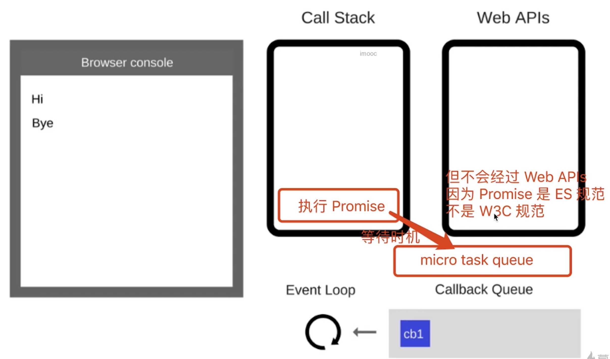
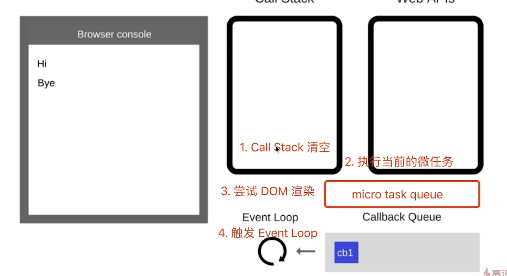

6. 宏任务和微任务总结
* 宏任务有哪些？ 微任务有哪些？ 微任务触发时机更早
* 微任务、宏任务和DOM渲染的关系？
* 微任务、宏任务和DOM渲染,在event loop的过程


### 解答js异步的面试题
1. 描述event loop的机制
* 回顾event loop的过程
* 和Dom渲染的关系
* 微任务和宏任务在event loop过程中的不同处理

2. 什么是宏任务(macrotask)和微任务(microtask),两者区别是什么？
* 宏任务： setTimeout、 setInterval、ajax、 DOM事件
* 微任务： Promise、 async/await
* 微任务执行时机比宏任务要早

3. Promise的3种状态如何变化
* pending resolved rejected
* pengding -> resolved 或 pending -> rejected
* 过程不可逆
会出场景题,记住这几条规则(
* pending 状态，不会出发then和catch
* resolved状态，会触发后续的then回调函数
* rejected状态，会触发后续的catch回调函数)

4. 题目分析
```
async function async1(){
    console.log('async1 start') // 2
    await async2()
    // await 后面的都做为回调内容 - 微任务
    console.log('async1 end') // 6
}
async function async2(){
    console.log('async2') // 3
}

console.log('script start') // 1
setTimeout(function(){
    console.log('setTimeout') //宏任务 // 8
}, 0)

async1()
// 初始化Promise时,传入的函数会被立即执行
new Promise(function (resolve) {
    console.log('promise1') // 4
    resolve()
}).then(function(){ // 异步微任务
    console.log('promise2') //7
})
console.log('script end') // 5
// 同步代码执行完毕(call stack被清空)
// 执行微任务
// 尝试触发Dom渲染
// 触发event loop,执行宏任务
```


