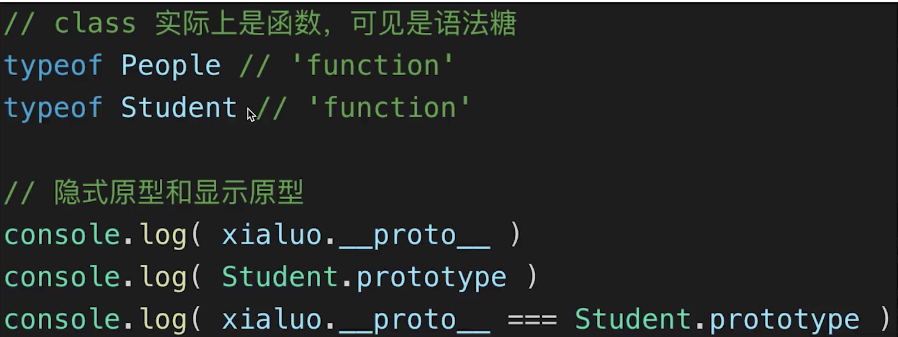
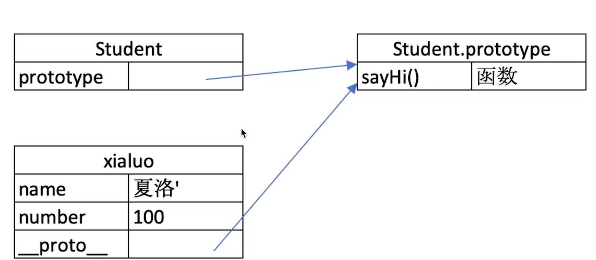
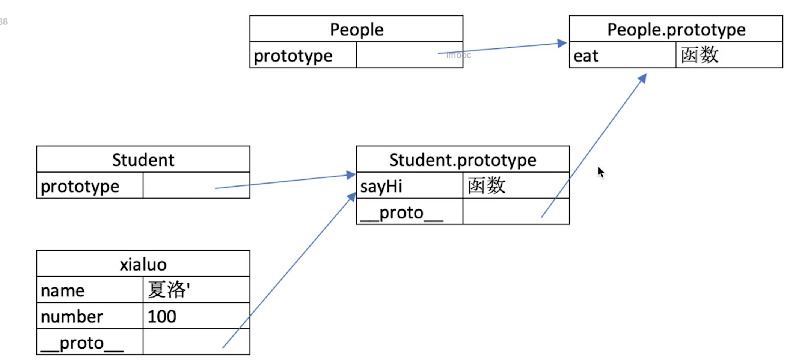
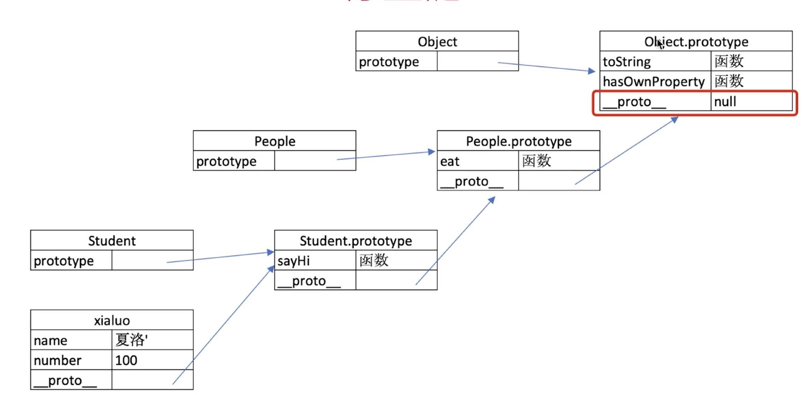

#### prototype题目
---
1. 如何准确判断一个变量是不是数组？
2. 手写一个简易jquery,考虑扩展性？
3. class原型的本质

#### 如何用class实现继承？

```
class People {
            constructor (name) {
                this.name = name
            }
            eat(){
                console.log(`${this.name} eat something`)
            }
        }

        class Student extends People {
            constructor(name, number) {
                super(name)
                this.number = number;
            }
            sayHi(){
                console.log(`姓名${this.name},学号${this.number}`)
            }
        }

        class Teacher extends People {
            constructor(name, major) {
                super(name)
                this.major = major;
            }
            teach(){
                console.log(`姓名${this.name},科目${this.major}`)
            }
        }
        let xialuo = new Student('夏洛', '130309')
        xialuo.sayHi()
        xialuo.eat()
        let madongmei = new Teacher('马冬梅', '数学')
        madongmei.teach()
        madongmei.eat()
```
2. 类型判断-instanceof
```
xialuo instanceof Student // true(xialuo是Student的创建的实例)
xialuo instanceof People // true
xialuo instanceof Object // true

[] instanceof Array // true
[] instanceof Object // true

{} instanceof Object // true
```

3. 原型


    a) 原型关系

        1. 每个class都有显示原型prototype
        2. 每个实例都有隐式原型__proto__
        3. 实例的__proto__指向class的prototype

    b) 执行规则

        1. 获取属性和方法首先在自身上查找
        2. 找不到去隐士属性上查找

4. 原型链


```
console.log(Student.prototype.__proto__) // People.prototype
```

* instanceof是指前面的对象的隐式原型是不是原型链上class的显示原型
```
xialuo instanceof Object // true
xialuo instanceof Array // false
```


#### 问题解答
---
1. 如何准确判断一个变量是不是数组？
`a instanceof Array`
2. class原型的本质
    原型和原型链的图示
    属性和方法的执行规则
3. 手写一个简易jquery,考虑扩展性？
    ```
    class jQuery {
        constructor(selector) {
            const result = document.querySelctorAll(selector);
            const length = result.length;
            for (let i = 0; i < length; i++) {
                this[i] = result[i]
            }
            this.length = length;
            this.selector = selector
        }
        get(index) {
            return this[index]
        }
        each(fn) {
            for (let i = 0;i < this.length; i++) {
                const elem = this[i];
                fn(elem)
            }
        }
        on (type, fn) {
            return this.each(elem => {
                elem.addEventListener(type, fn, false)
            })
        }
        // 扩展很多方法
    }

    // 插件
    jQuery.prototype.dialog = function(info) {
        alert(info)
    }
    // 造轮子
    class myJquery extends jQuery {
        constructor(selector){
            super(selector)
        }
        // 扩展自己的方法
        addClass(className) {
            
        }
    }

    var $p = new jQuery('p');
    $p.get(1)
    $p.each(elem => console.log(elem.nodeName))
    $p.on('click', ()=> alert('clicked'))
    ```