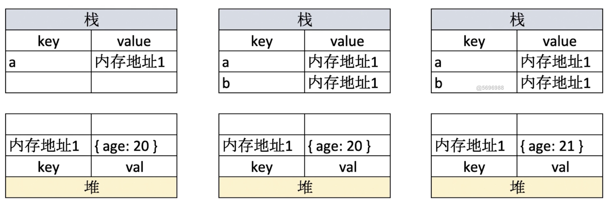
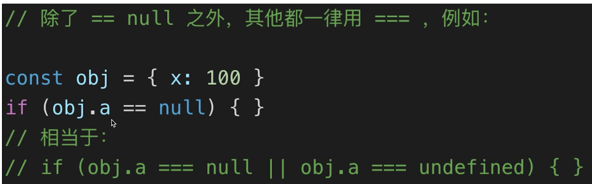
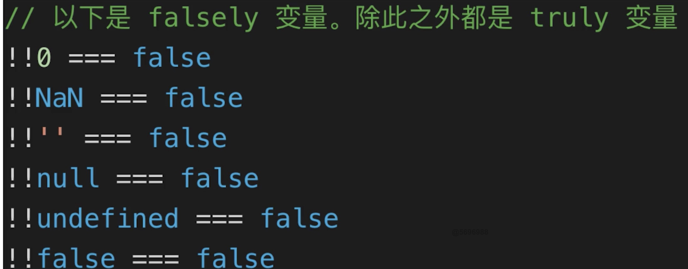
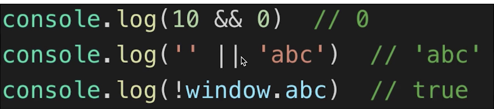

#### 题目
---
1. typeof能判断哪些类型
2. 何时使用===何时使用==
3. 值类型和引用类型区别
4. 手写深拷贝

1. typeof能判断哪些类型

* 引用类型存储在堆中(自下而上存储),值类型存储在栈中


* 引用类型和值存储不同，是考虑到性能问题，为了防止对象过大
* 常见引用类型（对象，数组，null, 函数）
```
1. 识别所有值类型number、string、boolean、undefined、symbol
2. 判读函数： function
3. 引用类型： object(不能再继续识别)
```


2. 手写深拷贝
```
function deepClone (obj = {}) {
    if(typeof obj != 'object' || obj == null) {
        return obj;
    }
    // 初始化返回结果
    let result
    if(obj instanceof Array) {
        result = [];
    } else {
        result = {}
    }
    for (var key in obj) {
        // 保证key不是原型属性
        if (obj.hasOwnProperty(key)) {
            // 递归调用
            result[key] = deepClone(obj[key])
        }
    }
    // 返回结果
    return result;
}
```

3. 何时使用 === 何时使用==


* if语句和逻辑运算

