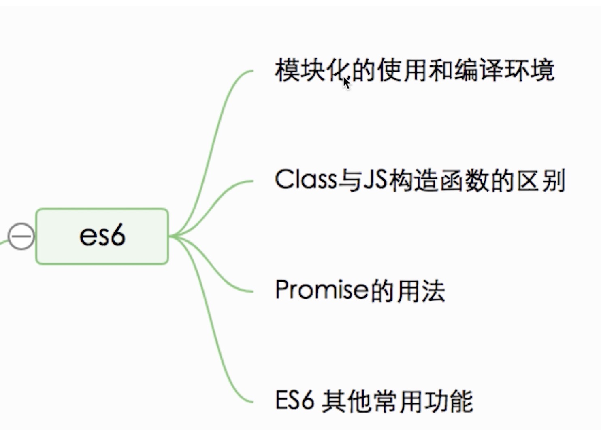

###  ES6模块如何使用,开发环境如何打包？
分析
* 模块化的语法
* 开发环境配置
* 关于JS众多模块化标准

##### (1)、 开发环境-babel
* 电脑有node环境，npm init
* npm install --save-dev babel-core babel-preset-es2015 babel-preset-latest
* 创建.babeIrc文件(.表示隐藏)
* npm i --global babel-cli
* babel --version
* ./src/index.js
* 内容： [1,2,3].map(item=>item + 1)
* babel index.js


##### (2)、开发环境-webpack
* npm i webpack babel-loader --save-dev
* 配置webpack.config.js
* 配置package.json中的scripts
* 运行npm start

##### (3)、开发环境-rollup
* npm init
* npm i rollup rollup-plugin-node-resolve rollup-plugin-babel babel-plugin-external-helpers babel-preset-latest -D
* 配置.babelrc
* 配置rollup.config.js

##### (4)、rollup和webpack
* rollup功能单一，webpack功能强大
* 工具尽量功能单一,可集成，可扩展

*解答*
* 语法：import export(注意有无default)
* 环境：babel编译es6语法,模块化可用webpack和rollup
* 扩展：自己对模块化标准统一的期待

### Class和普通构造函数有何区别
* JS构造函数
```
function MathHandle(a, b) {
    this.x=a;
    this.y=b;
}
MathHandle.prototype.add = function() {
    return this.x + this.y
}

var m = new MathHandle(1,2)

console.log(m.add())
```
* Class基本语法
```
class MathHandle {
    constructor(x, y) {
        this.x = x;
        this.y = y;
    }

    add () {
        return this.x + this.y
    }
}

const m = new MathHandle(1,2)
console.log(m.add())
```
* 语法糖
```
class MathHandle {
    // ...
}
typeof MathHandle // 'function'
MathHandle === MathHandle.prototype.constructor  // true
m.__proto__ === MathHandle.prototype // true

// 这种语法糖形式，看起来和实际原理不太一样的东西，个人不太赞同
// 形式上强行模仿java, c#,失去了它的本性和特性
```
* 继承
```
// 动物
function Animal () {
    this.eat = function () {
        console.log('animal eat');
    }
}
// 狗
function Dog () {
    this.dark = function () {
        console.log('dog dark');
    }
}
Dog.prototype = new Animal();
// 哈士奇
var hashiqi = new Dog();
```
* class
```
class Animal {
    constructor (name) {
        this.name = name
    }
    eat () {
        console.log('animal eat');
    }
}
class Dog extends Animal { // 相当于Dog.prototype = new Animal();
    constructor (name) {
        super(name)  // 被继承的animal的构造函数
        this.name = name
    }
    dark() {
        console.log(`${this.name} dark`)
    }
}

const dog = new Dog('哈士奇')
dog.dark()
dog.eat()
```

*解答*
* Class在语法上更加贴合面向对象的写法
* Class实现继承更加易读，易理解
* 本质还是语法糖，使用prototype
* 更易于写java等后端语言的使用

### Promise的语法(基本不问,语法要知道)
* new Promise实例，而且要return
* new Promise时要传入函数,函数有resolve和reject两个参数
* 成功时执行resolve,失败时执行reject
* then监听结果
```
function loadImg (src) {
    return new Promise(function (resolve, reject) {
        var img = document.createElement('img');
        img.onload = function() {
            resolve(img)
        }  
        img.onerror = function() {
            reject()
        }
        img.src=src
    })
}

var src = 'https://www.imooc.com/static/img/index/logo2020.png';
loadImg(src).then(function (img) {
    console.log(img)
    return img
}).then(function (img ) {
    console.log(img.height)
}
```

### ES6其他常用功能
* let/const
* 多行字符串/模板变量:`<p>${name}</p>`
* 解构赋值
* 块级作用域
* 函数默认参数
* 箭头函数




