### hybrid
---
#### 题目
* hybrid是什么？为何用hybrid?
* 介绍以下hybrid更新和上线的流程？
* hybrid和h5区别？
* 前端js和客户端如何通讯？

#### hybrid是什么？为何用hybrid?
---
* 文字解释
1. hybrid即"混合"，即前端和客户端的混合开发
2. 需前端和客户端配合完成
3. 某些环节可能涉及到server端

* 存在价值
1. 可以快速迭代更新(无需app审核,思考为何)
2. 体验更加流畅
3. 减少开发和沟通成本，双端公用一套代码

* webview
1. 是app中的一个组件（app中可以有webview,也可以没有）
2. 用于加载h5页面,即一个小型的浏览器内核
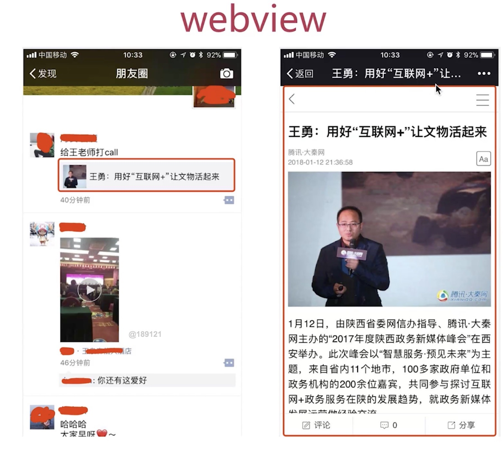

* file协议
1. 和http协议区别
    a. file协议:本地文件，快
    b. http（s）协议: 远程文件，慢
    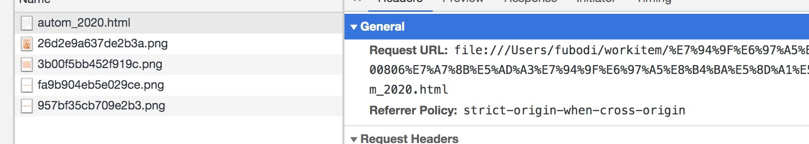

* 具体实现
1. 不是所有场景都适合hybrid
    a. 前端做好静态页面(html css js),将文件交给客户端
    b. 客户端拿到静态页面,以文件形式存储在app中
    c. 客户端在webview中
    d. 使用file协议加载静态页面
*实现模型*


*问题解答*
* hybrid是前端和客户端的混合开发
* hybrid存在的核心在于快速迭代，无需审核
* hybrid实现流程(图)，以及webview和file协议
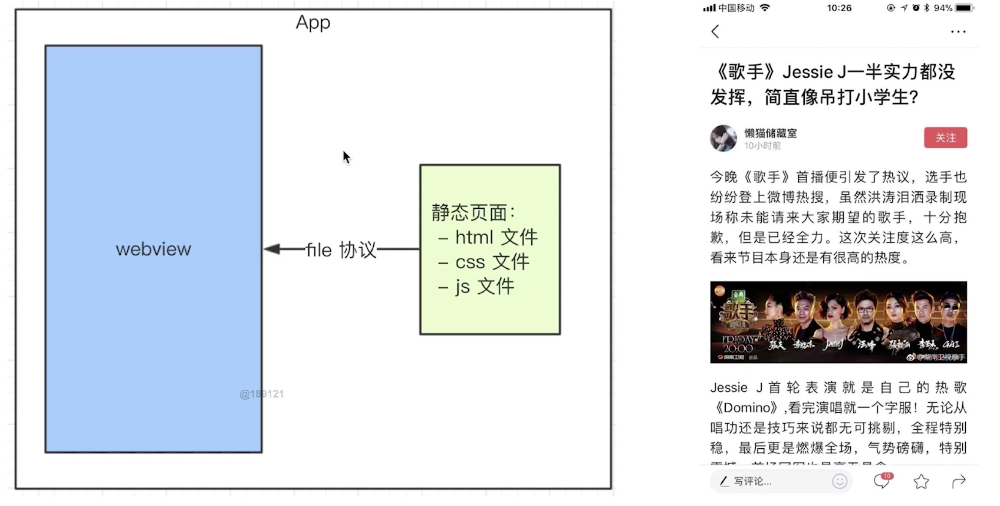

#### 介绍一下hybrid更新和上线的流程
---
* 分析
    1. 要替换每个客户端的静态文件
    2. 只能客户端来做
    3. 客户端（启动时)取server端下载最新的静态文件
    4. 我们维护server的静态文件
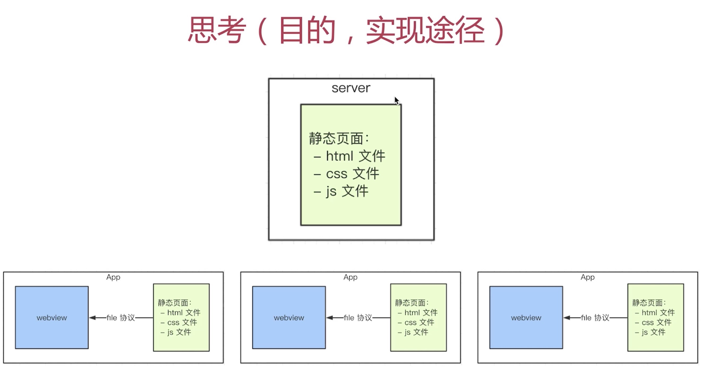


* 完整流程
    1. 分版本，有版本号
    2. 将静态文件压缩成zip包,上传到服务端
    3. 客户端每次启动，都去服务端检查版本号
    4. 如果服务端版本号大于客户端版本号，就去下载最新的zip包
    5. 下载完之后解压包，将现有文件覆盖
    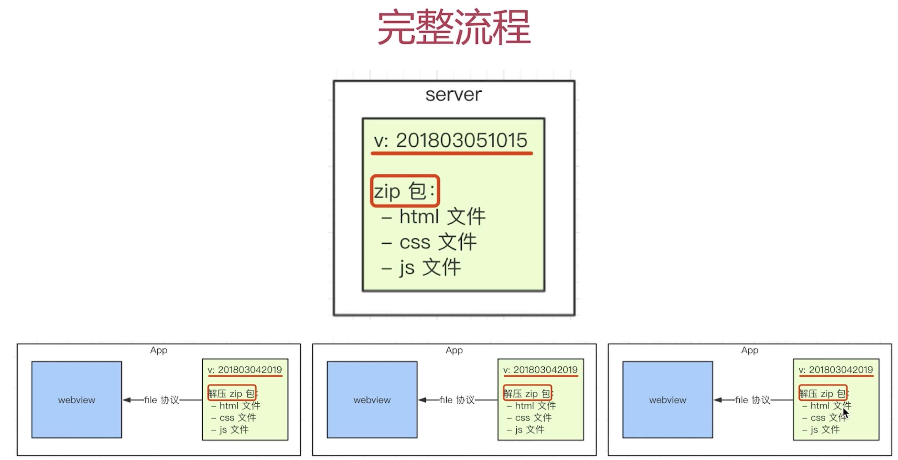

*问题解答*
* 掌握流程图
* 要点1：服务端的版本和zip包维护
* 要点2: 更新zip包之前,先对比版本号
* 要点3：解压包，覆盖现有文件

#### hybrid和h5区别？
---
* 优点
1. 体验更好
2. 可快速迭代，无需app审核
* 缺点
1. 开发成本高。开发、联调、查bug比较麻烦
2. 运维成本高。
* 适用场景
1. hybrid：产品的稳定功能，体验要求高，迭代频繁
2. h5: 单次的运营活动或不常用的功能

*问题解答*
* 优点： 体验好，可快速迭代
* 缺点： 开发、运维成本高
* 适用场景：hybrid适用稳定型产品，h5适合运营型

#### 前端js和客户端如何通讯？
---
wx提供的JSSDK是已经封装好了用js调用客户端提供的能力
* 遗留问题
    1. 新闻详情页适用hybrid,前端如何获取新闻内容？
    2. 不能用ajax获取。第一跨域，第二速度慢
    3. 客户端获取新闻内容，然后js通讯拿到内容，再渲染
    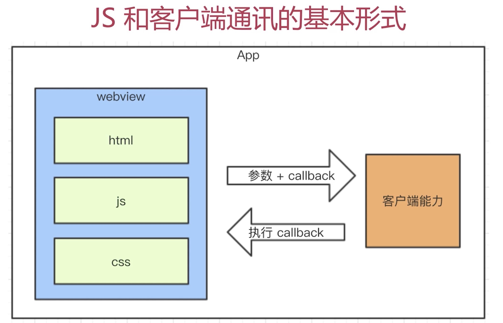

* js和客户端通讯的基本形式
    1. JS访问客户端能力，传递参数和回调函数
    2. 客户端通过回调函数返回内容

* 前端和客户端通信协议-schema(前端和客户端的通信协议)
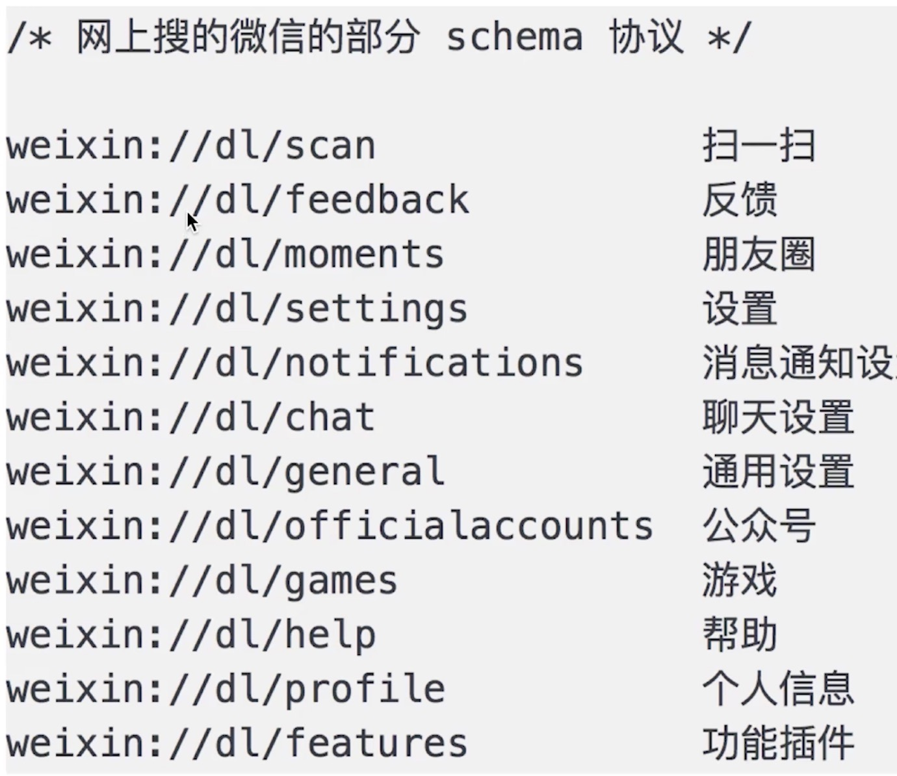

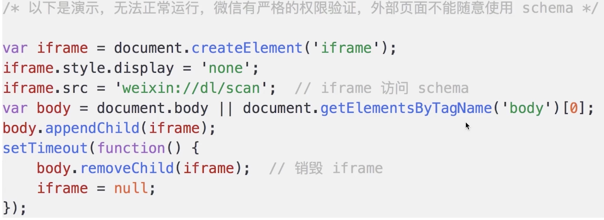
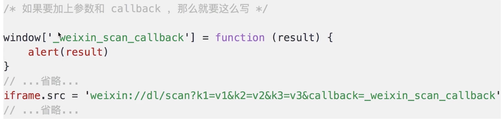
类似于jsonp通信
```
<body>
    <button id="btn">扫一扫</button>
    <script>
        window['_invoke_scan_callback_'] = function(result) {
            alert(result)
        }
        function invokeScan(){
            var iframe = document.createElement('iframe');
            iframe.style.display = 'none';
            iframe.src = 'weixin://dl/scan?k1=v1&callback=_invoke_scan_callback_'
            var body = document.body;
            body.appendChild(iframe);
            setTimeout(function(){
                body.removeChild(iframe);
                iframe = null
            })
        }
        document.addEventListener('click', function(){
            invokeScan()
        })
    </script>
</body>
```

* schema的封装
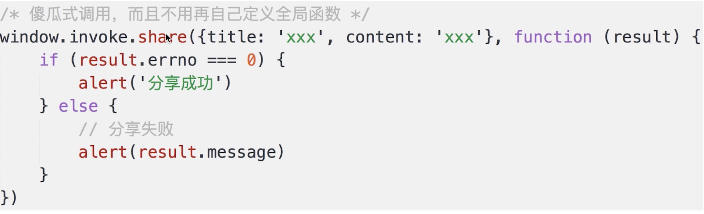
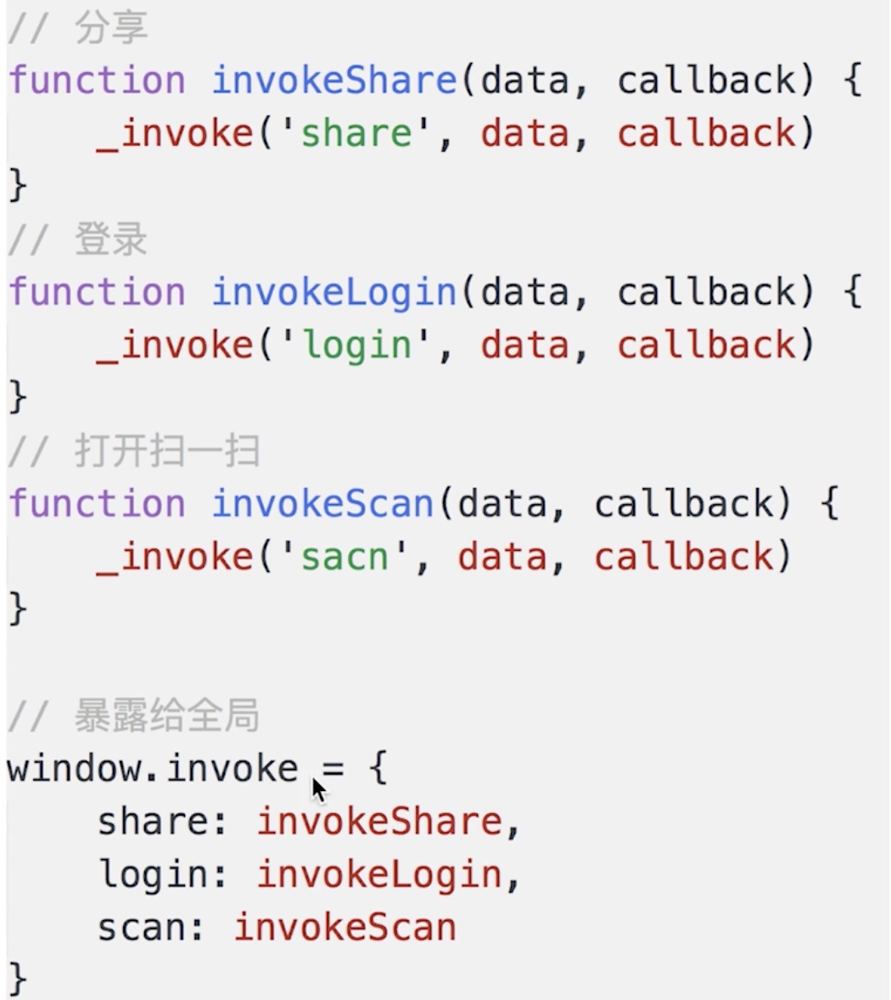
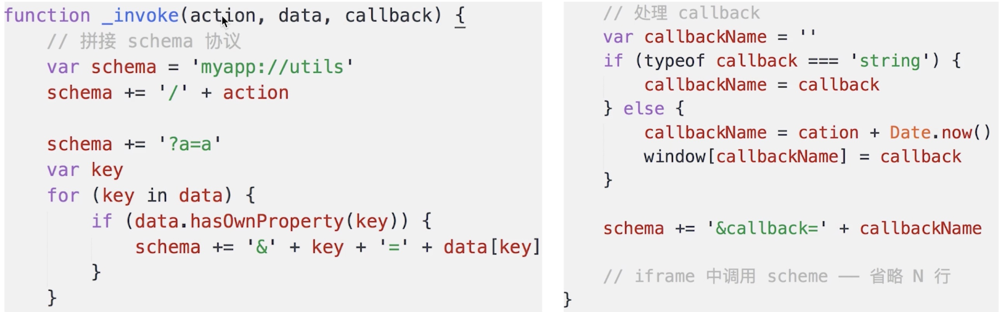
```
(function(window, undefined){
    function _invoke(action, data, callback){
        // 拼装schema
        var schema = 'maapp://utils/' + action;
        //拼接参数
        schema += '?a=a'
        var key
        for(key in data) {
            schema += '&' +key + data[key]
        }
        // 处理callback
        var callbackName = ''
        if (typeof callback == 'string') {
            callbackName = callback;
        } else {
            callbackName = action + Date.now();
            window[callbackName] = callback
        }
        schema += '&callback=' + callbackName
        // 触发
        var iframe = document.createElement('iframe');
        iframe.style.display = 'none';
        iframe.src = 'weixin://dl/scan?k1=v1&callback=_invoke_scan_callback_'
        var body = document.body;
        body.appendChild(iframe);
        setTimeout(function(){
            body.removeChild(iframe);
            iframe = null
        })
    }

    window.invoke = {
        share: function(data, callback){
            _invoke('share', data, callback)
        },
        scan: function(data, callback){
            _invoke('share', data, callback)
        },
        login: function(data, callback){
            _invoke('login', data, callback)
        }
    }
})(window)
```

调用

```
window.invoke.share({title:'',content: 'xxx'}, function(result){
                if (result.errno == 0) {
                    alert('分享成功')
                }
            })
```

* 内置上线

1. 将以上封装的代码打包，叫做invoke.js,内置到客户端
2. 客户端每次启动webview,都默认执行invoke.js
3. 本地加载,免去网络加载的时间，更快
4. 本地加载，没有网络请求,黑客看不到schema协议，更安全

*问题解答*
1. 通讯的基本形式： 调用能力、传递参数、监听回调
2. schema协议的理解： 规定前端和客户端如何通讯交流,可以使用iframe进行使用
3. 调用schema代码的封装
4. 内置上线： 更快、更安全

### 总结
---


