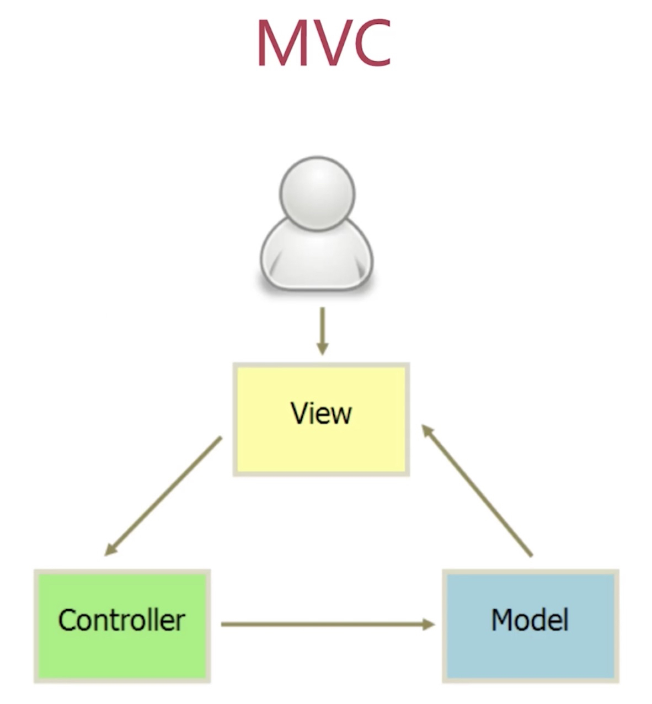
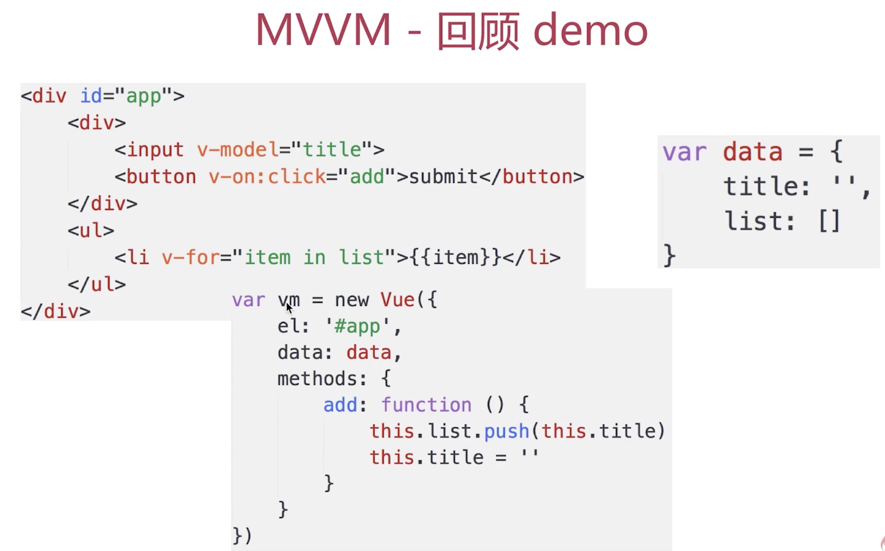
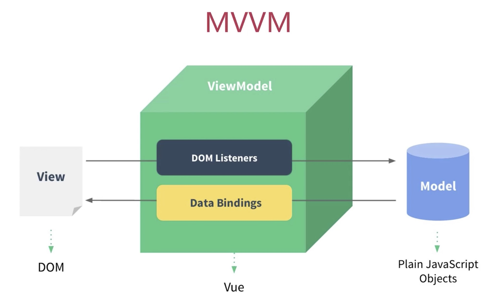
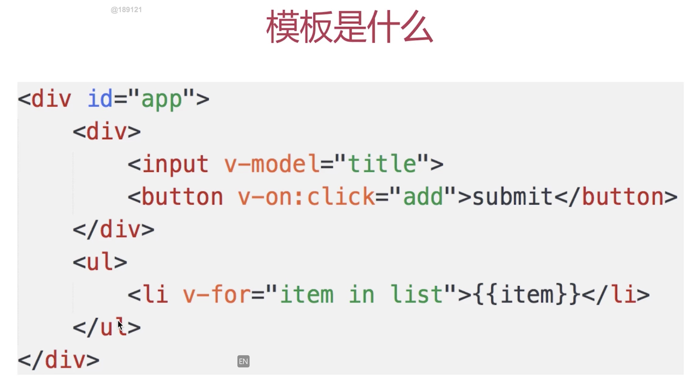
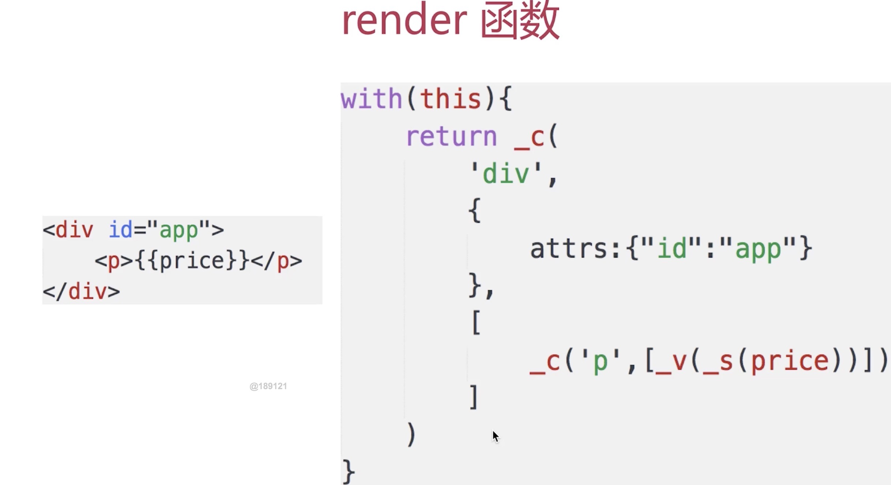
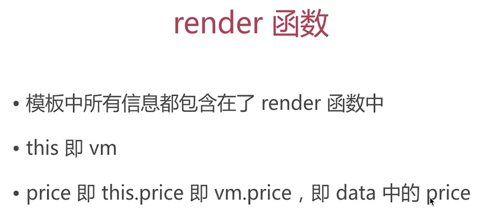
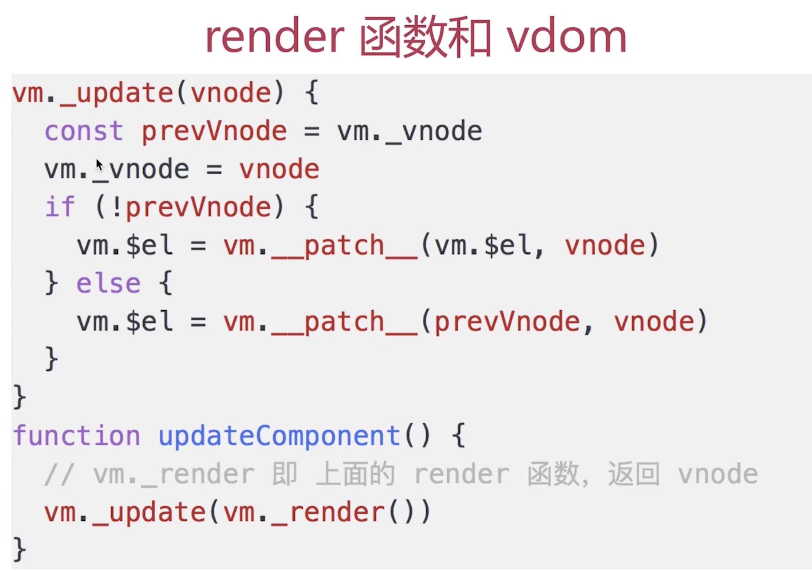
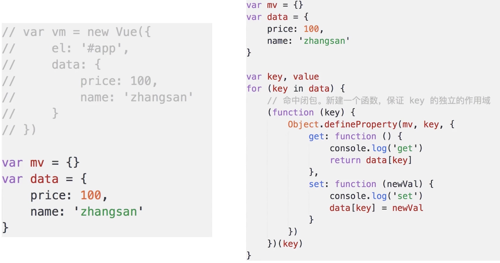

### MVVM

* 如何理解MVVM
* 如何实现MVVM
* 是否解读过vue源码

#### 题目
* 说一下使用jquery和使用框架的区别
* 说一下对MVVM的理解
* vue如何实现响应式
* vue中如何解析模板
* vue的整个实现流程

##### 说一下使用jquery和使用框架的区别
---
(1). jquery实现todo-list
```
<!DOCTYPE html>
<html lang="en">
<head>
    <meta charset="UTF-8">
    <meta name="viewport" content="width=device-width, initial-scale=1.0">
    <title>Document</title>
</head>
<body>
    <div>
        <input type="text" name="" id="txt-title"/>
        <buttonn id="btn-submit">submit</buttonn>
    </div>
    <div>
        <ul id="ul-list"></ul>
    </div>
    <script src="https://cdn.bootcss.com/jquery/3.2.0/jquery.min.js"></script>
    <script>
        var $txt = $('#txt-title');
        var $btn = $('#btn-submit')
        var $ul = $('#ul-list')
        $btn.click(function(){
            var val = $txt.val();
            if (!val) {return}
            var $li = $('<li>' + val + '</li>')
            $ul.append($li);
            $txt.val('')
        })
    </script>
</body>
</html>
```

(2)、vue实现todo-list
```
<!DOCTYPE html>
<html lang="en">
<head>
    <meta charset="UTF-8">
    <meta name="viewport" content="width=device-width, initial-scale=1.0">
    <title>todolist by vue</title>
</head>
<body>
    <div id="app">
        <div>
            <input v-model="title"/>
            <button @click="add">add</button>
        </div>
        <div>
            <ul>
               <li v-for="item in list">{{item}}</li> 
            </ul>
        </div>
    </div>
    <script src="https://cdn.jsdelivr.net/npm/vue"></script>
    <script>
        var vm = new Vue({
            el: '#app',
            data: {
                title: '',
                list: []
            },
            methods: {
                add(){
                    if (!this.title) return ;
                    this.list.push(this.title);
                    this.title = ''
                }
            },
        })
    </script>
</body>
</html>
```

(3)、两者的区别
* 数据和视图分离
* 以数据驱动视图

*问题解答*
* 数据和视图分离, 解耦(开放封闭原则)
* 以数据驱动视图,只关心数据变化，DOM操作被封装（jquery就是一个dom操作的库）


##### 说一下对MVVM的理解
1. MVC

M-数据
V-视图
C-控制器，逻辑处理


2. MVVM

M-模型、数据
V-视图、模板(视图和模型是分离的)
viewmodel-连接model和view




*问题解答*
* MVVM - Model(数据模型) View（视图） ViewModel(连接器，连接view和model)
* 三者之间的联系,以及如何对应到各段代码
* ViewModel的理解，联系view和Model(view通过事件绑定的方式影响到model,model可以通过数据绑定影响到view)
* mvvm不是一个从零开始的创新,是由mvc发展过来的,mvc应用到后端，为了适应前端场景，把controler变为viewModel，属于微创新

MVVM框架的三要素
* 响应式: vue如何监听到data的每个属性变化
* 模板引擎： vue的模板如何被解析？指令如何处理？
* 渲染： vue的模板如何被渲染成html？以及渲染过程


##### vue如何实现响应式
---
* 什么是响应式

(1). 修改data属性之后,vue立刻监听到
(2). data属性被代理到vm上

* Object.defineProperty
```
var obj = {};
var _name = 'zhangsan'
Object.defineProperty(obj, 'name', {
    get: function() {
        console.log('get') // 监听
        return _name
    },
    set: function(newval) {
        console.log('set') // 监听
        _name = newval
    }
})
```

* 模拟
```
var vm = {};
var data = {
    price: 100,
    name: 'zhangsan'
}
var key, value
for(key in data) {
    (function(key){
        Object.defineProperty(vm, key, {
            get: function() {
                console.log('getter')
                return data[key]
            },
            set: function(newval) {
                console.log('setter');
                data[key] = newval
            }
        })
    })(key)
}
```
*问题解答*
* 关键是理解Object.defineProperty(深入骨髓)
* 将data属性代理到vm上


##### vue中如何解析模板
---
1. 模板是什么
2. render函数
3. render函数和vdom

*模板是什么*
* 本质： 字符串
* 有逻辑,如v-if、v-for等
* 与html格式很像，但有很大区别
* 最终还要转换为html来显示
那是怎么做到从字符串转换成html

* 模板最终必须转换成js代码,因为
* 有逻辑(v-ifv-for),必须用js才能实现（图灵完备语言）
* 转换为html渲染页面，必须用js才能实现
* 因此，模板最终要转换成一个js函数(render函数)


*render函数*
* 从哪里可以看到render函数？
* 复杂一点的例子,render函数是什么样子的？
* v-if v-for v-on都是什么样子的？

vue2.0开始支持预编译(开发环境下写模板,编译打包后就是js)
react 组件化
JSX 模板
编译: -> JS代码
*模板*
```
<div id="app">
    <div>
        <input v-model="title"/>
        <button @click="add">add</button>
    </div>
    <div>
        <ul>
            <li v-for="item in list">{{item}}</li> 
        </ul>
    </div>
</div>
```
*render函数*
```
with(this){ // this 就是vm
    return _c(
        'div',
        {
            attrs:{"id":"app"}
        },
        [
            _c(
                'div',
                [
                    _c(
                        'input',
                        {
                            directives:[
                                {
                                    name:"model",
                                    rawName:"v-model",
                                    value:(title),
                                    expression:"title"}
                                ],
                                domProps:{
                                    "value":(title)
                                },
                                on:{
                                    "input":function($event){
                                        if($event.target.composing)
                                            return;
                                        title=$event.target.value
                                    }
                                }
                        }),
                        _v(" "),
                        _c(
                            'button',
                            {
                                on:{
                                    "click":add
                                }
                            },
                            [
                                _v("add")
                            ])
                ]
            ),
            _v(" "),
            _c(
                'div',
                [
                    _c(
                        'ul',
                        // 返回一个数组
                        _l(
                            (list),
                            function(item){return _c('li',[_v(_s(item))])}
                        )
                    )
                ]
            )
        ]
    )
}
```
*根据todo-list demo的render函数*
* v-model怎么实现 
双向数据绑定，有get和set
* v-on:click怎么实现
绑定一个自定义函数
* v-for怎么实现
vm._l遍历,针对list进行遍历，遍历完返回一个数组


---
* 已经解决了模板中"逻辑"(v-for、v-if)的问题
* 还剩下模板生成html的问题
* 另外,vm._c返回了什么?render函数返回了什么？



##### 总结
---
* updateComponent中实现了vdom的patch;
* 页面首次渲染执行updateComponennt
* data中每次修改属性,执行updateComponennt

*问题解答*
* 模板：字符串，从语法上讲有逻辑，可以嵌入js变量
* 模板必须转换为js代码（因为它有逻辑、渲染html、js变量,只有js才能处理）
* render函数是什么样子的(with语法;render结构相当于h函数)
* render函数返回vnode
* 对比vnode,执行patch，在updataComponent中执行(分为有vnode的时候和没有vnode的时候)

##### vue的整个实现流程

1. 第一步： 解析模板成render函数

 + with语法
 + 模板中所有信息都被render函数所包含
 + 模板中用到的data中的属性都变成了js变量
 +  模板中的v-model、v-for、v-if都变成了js逻辑
 +  render函数最后返回vnode
2. 第二步： 响应式开始监听

  + Object.defineProperty
  + 将data的属性代理到vm上

3.  第三步:  首次渲染，展示页面,且绑定依赖

  + 初次渲染，执行updateComponent,执行vm._render()
  + 执行render函数，会访问vm.title和vm.list
  + 会被响应式的get方法监听到(后面详细讲)
  + 执行updataComponent,会走到vdom的patch方法
  + patch将vnode渲染成DOM,初次渲染完成

  为何要监听get,直接监听set不行吗
  + data中有很多属性，有些被用到，有些可能不被用到
  + 被用到的会走到get,不被用到的不会走到get
  + 未走到get中的属性，set的时候也无需关心
  + 这样的好处就是避免重复渲染
4. 第四步： data属性变化，触发rerender

+ 修改属性,被响应式的set监听到
+ set中执行updateComponent
+ updateComponent重新执行vm._render()
+ 生成的vnode和prevnode，通过patch进行对比
+ 渲染到html中

*问题解答*
+ 解析模板成render函数
+ 响应式开始监听
+ 首次渲染，展示页面,且绑定依赖
+ data属性变化，触发rerender


### 总结
---

