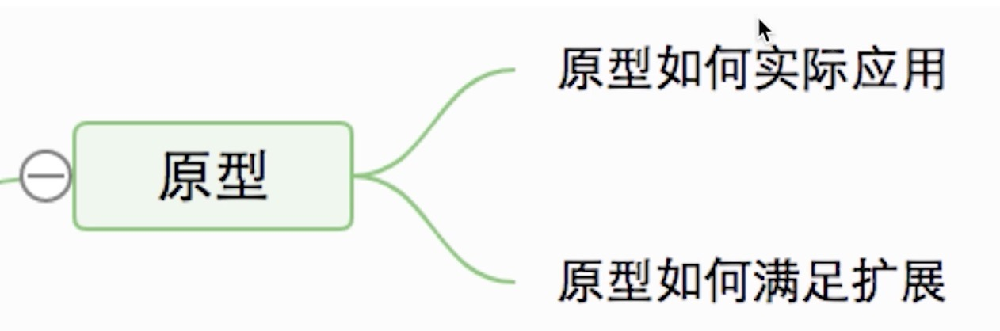

####  说一个原型的实际应用
---
zepto原理
```
(function(){
    var zepto = {};
    function Z () {
        var i, len = dom ? dom.length : 0;
        for(i = 0; i<len;i++) {
            this[i] = dom[i]
        }
        this.length = len;
        this.selector = selector || ''
    }
    zepto.Z = function(dom, selector) {
        return new Z(dom, selector)
    }
    zepto.init = function (selector) {
        var slice = Array.prototype.slice;
        var dom = slice.call(document.querySelectorAll(selector))
        return zepto.Z(dom, selector)
    }
    var $ = function() {
        return zepto.init(selector)
    }
    window.$ = $

    $.fn = {
        css: function(key, value) {
            alert('css')
        },
        html: function(value) {
            alert('html')
        }
    }
    Z.prototype = $.fn
})(window)
```
jquery原理
```
(function (window) {
    var jQuery = function(selector){
        return new jQuery.fn.init(selector)
    }
    jQuery.fn = {
        css: function(key, value) {
            alert('css')
        },
        html: function(value) {
            return 'jquery'
        }
    };
    var init = jQuery.fn.init = function(selector){
        var slice = Array.prototype.slice;
        var dom = slice.call(document.querySelectorAll(selector));
        var i, len = dom ? dom.length : 0;
        for (i = 0; i< len;i++) {
            this[i] = dom[i]
        }
        this.length = len;
        this.selector = selector || ''
    }
    init.prototype = jQuery.fn
    window.$ = jQuery
})(window)
```
问题解答
* 描述一下jquery如何使用原型(入口函数、构造函数、原型)
* 描述一下zpeto如何使用原型
* 描述下自己的项目经验


####  原型如何扩展它的应用
* 总结jquery和zepto原型的使用
* 插件机制

为什么要把原型方法放在$.fn?
因为要扩展插件,最终目的是把插件放在原型上去，放的方式不是直接给prototype赋值，而是通过$.fn
好处：
* 只有$会暴露在window全局变量
* 将插件扩展统一到$.fn.xxx这一个接口，方便使用
```
// 插件扩展
$.fn.getNodeName = function () {
            alert(this[0].nodeName) 
        }
var $p = $('p');
$p.getNodeName()
```
问题解答
* 说一下jquery和zepto的插件机制
* 结合自己的开发经验,做过的基于原型的插件

