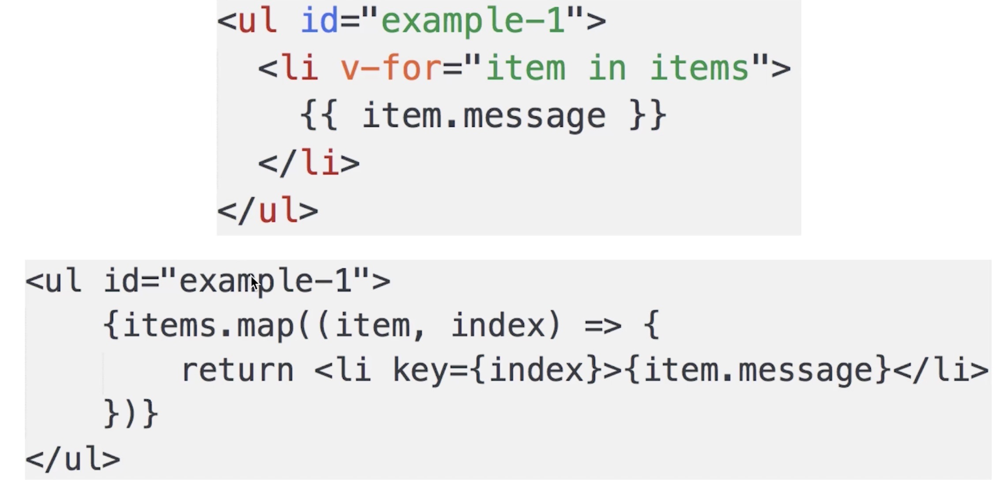

#### 组件化
* 是否做过React开发？
* React以及组件化的核心概念？
* 实现流程
`数据视图分离、数据驱动视图`
#### 题目
1. 说一下对组件化的理解
 * 组件的封装
    a. 视图
    b. 数据
    c. 变化逻辑（数据驱动视图变化）
   
 * 组件的复用
    a. props传递
    b. 复用
    
    
*问题解答*
    主要分为2个方面:封装和复用
    封装是指对视图、数据、变化逻辑进行封装，变化逻辑是指数据驱动视图的变化
    另外一方面是组件的复用,通过传不同的属性达到复用的效果
    
2. JSX本质是什么
  * JSX语法
    a. html形式
    b. 引入JS变量和表达式
    c. if...else...
    d. 循环
    e. style和className
    f. 事件
    ```
    import React, {Component} from 'react'
    class App extends Component {
        render(){
            const show = true
            const name = 'zhangsan';
            const list = [1,2,3]
            const styleConfig = {
                fontSize: '40px',
                color: 'blue'
            }
            return (
                <div className="container">
                    </* <p>haha</p> */> //注释
                    <p>{name}</p>
                    {show ?  : ''}
                    <ul>
                        {list.map((item, index)=> }{
                            return <li key={index}>{item}</li>
                        })}
                        
                    </ul>
                    <p style={styleConfig}>this is a p</p>
                    <p style={ {fontSize: '40px',color: 'blue'} }>this is a p</p>
                </div>
            )
        }
    }
    ```
    g. JSX语法根本无法被浏览器解析

  * JSX解析成js
    
    
    ```
        JSX其实是语法糖
        开发环境会将JSX编译成JS代码
        JSX可以降低学习成本
        增加debug成本
    ```
  * 独立的标准
    a. JSX是React引入的，但不是React独有的
    b. React已经将它作为一个独立标准开放,其他项目也可用
    c. React.createElement是可以自定义修改的
    d. 说明: 本身功能已经完备;和其他标准兼容和扩展性没问题

  *问题解答*
  ```
  JSX其实是语法糖,需被解析成js才能运行(vue的模板也要被解析成js运行;生成的js的形式：React.creatElement,也可以联系到vdom的h函数),JSX是独立的标准，可被其他项目使用
  ```
3. JSX和vdom的关系

    * 分析：为何需要vdom

        a. vdom是React初次推广开来的，结合JSX
        b. JSX就是模板,最终要渲染成html
        c. 渲染场景：初次渲染+修改state后的re-render
        d. 正好符合vdom的应用场景(数据视图分离+数据变化驱动视图变化)
        ```
        vdom复习
        介绍snabbdom
        核心api:生成vnode的h(标签，属性，子元素);patch(container, vnode)
        ```
    * Raact.createElement和h

    * 何时patch?
        a. 初次渲染-ReactDOM.render(<App/>, container)
        b. 会触发patch(container, vnode)
        c. re-render-setState
        d. 会触发patch(vnode, newVnode)
    * 自定义组件解析
    
    
        a. 'div'直接渲染`<div>`即可，vdom可以做到

        b. Input和List,是自定义组件(class),vdom默认不认识

        c. 因此Input和List定义的时候必须声明render函数

        d. 根据props初始化实例，然后执行实例的render函数（说明：返回jsx语法React.createCompnent）

        e. render函数返回的还是vnode对象

    *问题解答*
    ```
    JSX是一个语法糖，最终要渲染成html，要转换成js代码，需要使用vdom来数据驱动视图
    React.createElement和h，都会生成vnode
    何时patch:ReactDOM.render(...)和setState
    自定义组件的解析: 初始化实例,然后执行render
    ```
4. 说一下setState的过程
    *  setState为何需要异步
        ```
            可能会一次执行多次setState
            无法规定和限制用户如何使用setState
            没必要每次setState都重新渲染,考虑性能
            即便是每次渲染,用户也看不到中间效果（js执行和渲染不会同时进行，因为js是单线程的）
        ```
    *  vue修改属性也是异步
    ```
    原因同setState
    set中执行updateComponent,updateComponent是异步的
    ```
    *  过程
    ```
    1. 每个组件实例,都有renderComponent方法(Component类中的)
    2. 执行renderComponent会重新执行实例的render
    3. render函数返回newVnode,然后拿到preVnode
    4. 执行patch(prevnode, newvnode)
    ```
    *问题解答*
    * setstate是异步的,提高性能
    * vue修改属性也是异步的
    * state过程
5. 阐述自己对react和vue的认识
    * 本质区别
    ```
    1.vue - 本质是MVVM框架，由MVC发展而来
    2.React-本质是前端组件化框架，由后端组件化发展而来
    3.都能实现功能
    ```
    * 看模板和组件化的区别
        a.模板
    ```
    1. vue-使用模板(由angular提出)
    2. React-使用JSX
    3. 模板语法上,我更倾向于JSX(学习成本低，只需要懂{}中可以放表达式)
    4. 模板分离上,我更倾向于Vue(模板应该和js分离)
    ```
    
    
    
        b. 组件化的区别

    ```
    1.React本身就是组件化，没有组件化就不是React
    2.vue也支持组件化,是在MVVM上的扩展
    3.查阅vue组件化的文档，洋洋洒洒很多
    4.对于组件化，我更倾向于React,做的彻底清晰
    ```
    * 两者共同点
    ```
    1. 都支持组件化
    2. 都是数据驱动视图
    ```
    * 总结问题答案
    ```
    1. 国内使用,手推vue。文档更易读、易学、社区够大
    2. 水平较高的团队，推荐使用React,组件化和jsx做的比较好一些
    ```

#### 做一个todo-list
`sudo npm i create-react-app -g`
`create-react-app react-test`
`npm start`

#### React
1. 说一下对组件化的理解
 * 组件的封装： 封装视图、数据、变化逻辑
 * 组件的复用： props传递、复用
2. jsx本质
 * JSX语法(标签、js表达式、判断、循环、事件绑定)
 * JSX是语法糖,需被解析成js才能运行
 * JSX是独立的标准,可被其他项目使用
3. JSX和vdom的关系
 * 为何需要vdom:JSX需要渲染成html,还有rerender
 * React.createElement和h,都生成vnode
 * 何时patch:ReactDom.render(...)和setState
 * 自定义组件的解析: 初始化实例,然后执行render`const app = new App();return app.render()`
4. 说一下setState的过程
 * setState的异步: 效果、原因
 * vue修改属性也是异步： 效果、原因
 * setState的过程： 最终走到patch(prevnode, newVnode)
5. 阐述自己对react和vue的认识


