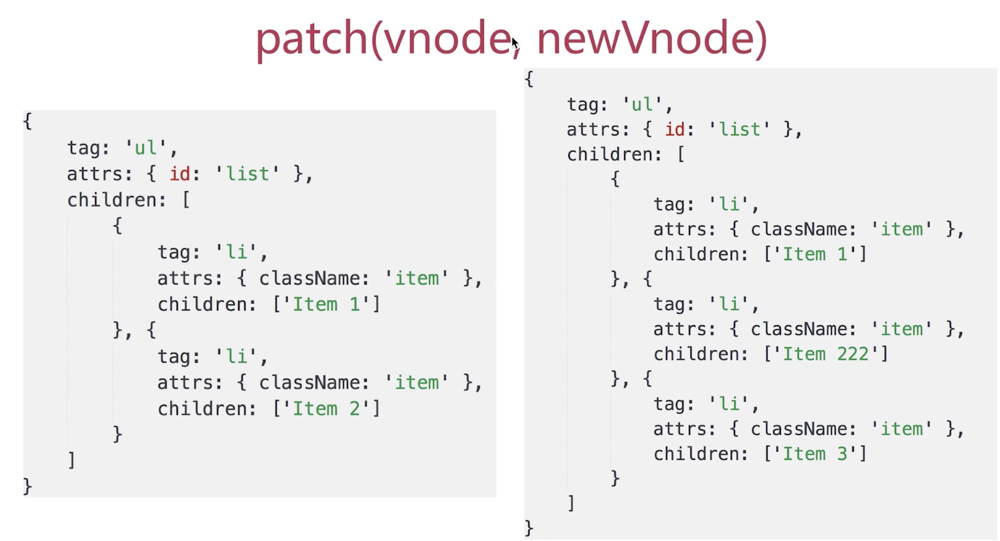

### vdom

* vdom是vue和react的核心
* vdom比较独立，使用也比较简单


#### 问题
---
* vdom是什么？为何会存在vdom?
* vdom如何应用,核心API是什么？
* 介绍一下diff算法


#### 什么是vdom？为何使用vdom
* 概念: 
    1. 虚拟DOM,
    2. 用js模拟DOM结构
    3. DOM变化的对比,放在js层来做
    4. 提高重绘性能
    
    

*DOM操作很昂贵*
*遇到的问题*

    1.  DOM操作是昂贵的，js运行效率高
    2.  尽量减少DOM操作,而不是「推倒重来」
    3. 项目越复杂,影响就越严重
    4. vdom可以解决这个问题


* 设计一个需求场景
* 用jquery实现
```
<!DOCTYPE html>
<html lang="en">
<head>
    <meta charset="UTF-8">
    <meta name="viewport" content="width=device-width, initial-scale=1.0">
    <title>Document</title>
</head>
<body>
    <div id="container"></div>
    <button id="btn-change">change</button>
    <script src="https://cdn.bootcss.com/jquery/3.2.0/jquery.min.js"></script>
    <script>
        var data = [
            {
                name: '张三',
                age: 20,
                address: '北京'
            },{
                name: '李四',
                age: 21,
                address: '上海'
            },{
                name: '王武',
                age: 22,
                address: '广州'
            }
        ]
        // 渲染函数
        function render (data) {
            var $container = $('#container')
            // 清空容器
            $container.html('')
            // 拼接table
            var $table = $('<table>')
            $table.append($('<tr><td>name</td><td>address</td><td>age</td></tr>'))
            data.forEach(function (item)  {
                $table.append($(`<tr><td>${item.name}</td><td>${item.address}</td><td>${item.age}</td></tr>`))
            });
            // 渲染到页面
            $container.append($table)
        }
        render(data)
        $('#btn-change').click(function () {
            data[1].age = 30;
            data[2].address = '西安'
            render(data)
        })
    </script>
</body>
</html>
```
*问题解答*

    *  虚拟DOM,
    *  用js模拟DOM结构
    *  DOM操作非常昂贵,项目越复杂,影响就越严重
    *  将DOM对比放在js层来做,提高效率

#### vdom如何应用,核心API是什么？
---
* 介绍snabbdom
* 重做之前的demo
```
<!DOCTYPE html>
<html lang="en">
<head>
    <meta charset="UTF-8">
    <meta name="viewport" content="width=device-width, initial-scale=1.0">
    <title>Document</title>
</head>
<body>
    <div id="container"></div>
    <button id="btn-change">change</button>
    <script src="https://cdn.bootcdn.net/ajax/libs/snabbdom/0.7.4/snabbdom.js"></script>
    <script src="https://cdn.bootcdn.net/ajax/libs/snabbdom/0.7.4/snabbdom-class.js"></script>
    <script src="https://cdn.bootcdn.net/ajax/libs/snabbdom/0.7.4/snabbdom-props.js"></script>
    <script src="https://cdn.bootcdn.net/ajax/libs/snabbdom/0.7.4/snabbdom-style.js"></script>
    <script src="https://cdn.bootcdn.net/ajax/libs/snabbdom/0.7.4/snabbdom-eventlisteners.js"></script>
    <script src="https://cdn.bootcdn.net/ajax/libs/snabbdom/0.7.4/h.js"></script>
    <script>
        var snabbdom = window.snabbdom

        // 定义patch
        var patch = snabbdom.init([
            snabbdom_class,
            snabbdom_props,
            snabbdom_style,
            snabbdom_eventlisteners
        ])
        // 定义h
        var h = snabbdom.h

        var container = document.getElementById('container')
        // 生成vnode
        var vnode = h('ul#list', {}, [
            h('li.item', {}, 'Item 1'),
            h('li.item', {}, 'Item 2')
        ])
        patch(container, vnode)
        document.getElementById('btn-change').addEventListener('click', function(){
            var newvnode = h('ul#list', {}, [
                h('li.item', {}, 'Item 1'),
                h('li.item', {}, 'Item B'),
                h('li.item', {}, 'Item 3')
            ])
            patch(vnode, newvnode)
        })
    </script>
</body>
</html>
```
* 核心API
```
h('标签名', {属性}, [子元素])
h('标签名', {属性}, '')
patch(container, vnode)
patch(vnode, newvnode)
```

*问题解答* 
```
如何使用？可用snabbdom的用法来举例
核心API: h函数，patch函数
```
    
### 介绍一下diff算法
---
* 什么是diff算法？
* 去繁就简
* vdom为何用diff算法
* diff算法的实现流程


1. 什么是diff算法？
diff是linux系统的运行命令，不是vdom自创

2. 去繁就简
1)、diff算法非常复杂,实现难度非常大,源码量很大
2)、去繁就简,讲明白核心流程,不关心细节
3)、面试官也大部分不清楚细节，但是很关心核心流程

3. vdom为何用diff算法
1)、 DOM操作是昂贵的，因此尽量减少DOM操作
2）、找出本次DOM必须更新的节点进行更新,其他的不更新
3）、这个『找出』的过程,就需要diff算法
找出前后vdom中之间的差异，再来更新这些差异


4. diff算法的实现流程
* `patch(container, vnode)`
* `patch(vnode, newVnode)`

实现

```
function createElement (vnode) {
    var tag = vnode.tag;
    var attrs = vnode.attrs || {}
    var children = vnode.children || [];
    if (!tag) {
        return null;
    }
    // 创建元素
    var elem = document.createElement(tag)
    var attrName;
    for(attrName in attrs) {
        if (attrs.hasOwnProperty(attrName)) {
            // 给elem添加属性
            elem.setAttribute(attrName, attrs[attrName])
        }
    }
    // 子元素
    children.forEach(function(childrenVnode) {
        // 给elem添加子元素
        elem.appendChild(createElement(childrenVnode)) //递归
    });
    // 返回真实的Dom节点
    return elem;
}
```



```
function updateChildren(vnode, newVnode) {
    var children = vnode.children || [];
    var newChildren = vnode.newChildren || [];
    children.forEach(function(childVnode, index) {
        var newChildVnode = newChildren[index];
        if (newChild[tag] == child[tag]) {
            // 深层次对比 递归
            updateChildren(childVnode, newChildVnode)
        } else {
            replaceNode(childVnode, newChildVnode)
        }
    })
}

function replaceNode (childVnode, newChildVnode) {
    var elem = childVnode.elem; // 真实的Dom节点
    var newElem = createElement(newChildVnode)

    // 替换
}
```
<del>节点新增和删除</del>
<del>节点重新排序</del>
<del>节点属性、样式、事件绑定等</del>

#### diff实现过程
* `patch(container, vnode)`和`patch(vnode, newVnode)`
* `createElement`
* `updateChildren`

*问题解答*
* 知道什么是diff算法,是linux的基础命令,并不是vue提出的独有命令,离我们并不遥远，平常都是对比文本
* vdom中应用diff算法是对比节点，为了找出需要更新的节点
* diff实现`patch(container, vnode)`(把vnode信息渲染到一个空的容器中)和`patch(vnode, newVnode)`(新旧vnode对比，将差异渲染对应的真实dom节点中)
* 核心逻辑 `createElement`和`updateChildren`
